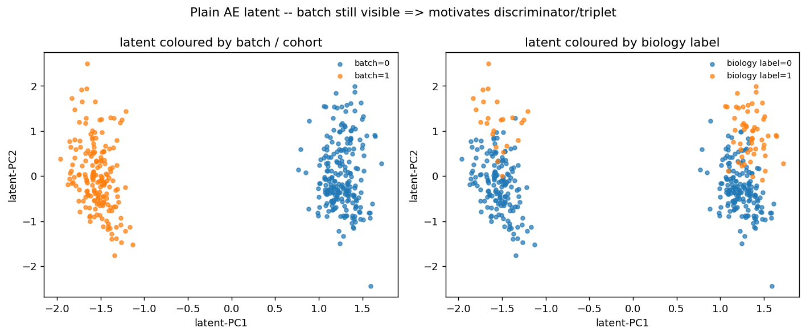

# Bulk Transcriptomics Autoencoder: Batch vs Biological Signal in Latent Space

**English** | [中文](#中文说明)

A PyTorch autoencoder for bulk RNA-seq that **quantifies** how much of the latent space is taken up by batch effect versus biological signal, and then attempts cross-cohort alignment with a **batch discriminator (adversarial)** and a **triplet loss**.

Two things make this repo different from most batch-correction code:

1. It **audits the study design before training anything.** Whether adversarial correction is even *possible* on a given dataset collection is a property of the design, not of the method — and it is decidable from metadata alone. `scripts/run_audit.py` answers that question first, on real cohort metadata, in one command.
2. It **honestly documents how hard adversarial training is to tune and the exact hyperparameters that make it diverge** (see §6). In the small-n / high-p bulk setting, whether a method is *reproducible* and *worth the added complexity* matters more than the method itself.

> **Status.** The design-audit and split layer runs on real metadata from GSE79362 and GSE94438 and is fully tested. The model layer currently runs on synthetic data; the supervised cross-cohort arm turns out to be **unavailable by design** — the two cohorts share no supervised label axis, verified in §3.3. §3.6 sets out the sharper question they can answer instead.

---

## 1. Files

### Data layer — runs on real cohort metadata

| File | Contents |
|---|---|
| `configs/studies.yaml` | Study registry. Column mappings, label-axis definitions, and which experiments each axis can support. Adding a cohort means adding a block here, not editing code. |
| `src/tbbatch/metadata.py` | Schema adapters onto a canonical frame. Namespaces donor IDs by study; `pool()` **raises** rather than concatenating cohorts whose negative classes mean different things. |
| `src/tbbatch/audit.py` | Cramér's V with Bergsma correction (batch↔label association), repeated-measures structure, Monte-Carlo donor-leakage estimation. |
| `src/tbbatch/timeaxis.py` | Parses `TimeToTB` into days across cohorts. Handles unit mismatch, the non-`NA` `"---"` sentinel, and post-diagnosis negative times; returns an explicit `kind` per row rather than coercing. Also donor-level power and within-donor spread (§3.7.1–2). |
| `src/tbbatch/splits.py` | Leave-one-study-out (outer) and donor-grouped stratified k-fold (inner), plus a batch-balanced minibatch sampler. Every split is asserted before it is returned; a leaking split **raises** rather than quietly scoring. |
| `scripts/run_audit.py` | One command → `results/design_audit.md`. |
| `data/metadata/` | Sample-level metadata for both cohorts (no expression values), so the audit is reproducible without a Bioconductor install. See its README for provenance. |
| `tests/test_splits.py` | 10 tests. Three construct leaking splits deliberately and assert the guards fire. |

### Model layer — currently synthetic

| File | Contents |
|---|---|
| `ae_bulk.py` | Data (synthetic demo + real-data hook), preprocessing, plain autoencoder, **latent diagnostics** (linear probe + silhouette), **linear baselines** (PCA / removeBatchEffect), latent visualization |
| `ae_adv_triplet.py` | Extends `ae_bulk.py` with a **batch discriminator (two-optimizer adversarial)** + **cross-batch triplet loss**, reusing the same diagnostics for a direct comparison |

## 2. Quick start

```bash
pip install -r requirements.txt

# 1. Audit the design first — no count matrices needed
python scripts/run_audit.py --registry configs/studies.yaml --root .
cat results/design_audit.md

# 2. Verify the leakage guards actually fire
python -m pytest tests/ -q

# 3. Model layer (synthetic data)
python ae_bulk.py          # plain AE + two linear baselines + diagnostics + latent plot
python ae_adv_triplet.py   # adversarial + triplet version, compared against the plain AE
```

To use your own data, fill in the `load_real()` stub in `ae_bulk.py`, returning `(X, batch, bio)` — `X` is a log-normalized expression matrix (log1p CPM / VST, restricted to shared genes), `batch` is the cohort id, and `bio` is the biological label. **Take the sample ordering and the split indices from the data layer** (`tbbatch.splits`) rather than splitting inside the model script; §3 explains why that matters here specifically.

---

## 3. Design audit: what the metadata says before any model runs

Everything in this section is a property of the study design. None of it requires expression values, and all of it constrains what the model layer is allowed to claim. Regenerate with `scripts/run_audit.py`; full output in [`results/design_audit.md`](results/design_audit.md).

Cohorts: **GSE79362** (ACS adolescent cohort, Zak et al. 2016) and **GSE94438** (GC6-74 household contacts, Suliman et al. 2018).

### 3.1 Batch is *not* meaningfully confounded with label — good news, and a correction

Cramér's V between the technical variable and the biological label:

| Association | Cramér's V | Reading |
|---|---|---|
| study × label (pooled, n=783) | **0.072** | negligible |
| site × label (within GSE94438, n=428) | **0.069** | negligible |

| study | label=0 | label=1 | n | positive rate |
|---|---|---|---|---|
| GSE79362 | 245 | 110 | 355 | 0.310 |
| GSE94438 | 327 | 101 | 428 | 0.236 |

This matters because adversarial batch removal has a hard precondition: if batch determined the label, the data would contain no counter-examples, and *any* method that erases batch would necessarily erase biology with it. **That failure mode does not apply here.** The design contains the counter-examples the method needs.

> **Correction to an earlier version of this README.** A previous revision justified reaching for adversarial correction partly on the grounds that "batch is confounded with the biological label — the progressor fraction differs between cohorts." Measured, the difference is 0.310 vs 0.236, Cramér's V = 0.072. **That justification does not hold for these two cohorts** and has been removed. The remaining justifications in §5.2 — non-linear batch structure, and wanting a reusable encoder — are unaffected.

### 3.2 The real leakage risk is donor-level, and it is severe

| study | samples | donors | donors w/ repeats | max/donor | effective-N inflation |
|---|---|---|---|---|---|
| GSE79362 | 355 | **144** | 105 | 6 | **2.47×** |
| GSE94438 | 428 | 334 | 79 | 4 | 1.28× |

Monte-Carlo over 2000 random 80/20 **sample-level** splits, counting donors that land on both sides:

| study | mean donors leaked | min | max | P(clean split) |
|---|---|---|---|---|
| GSE79362 | 47.7 | 35 | 60 | **0.000** |
| GSE94438 | 27.8 | 14 | 42 | **0.000** |

Not one clean split in 2000 draws, for either cohort. On GSE79362 a random split is not *risky*, it is **guaranteed** to put the same person's timepoints on both sides, and the effective sample size is 144 rather than 355.

This is the same repeated-measures structure that, in the [sibling DE analysis](https://github.com/melodysum/TB-Whole-Blood-Transcriptomics-GSE79362-GSE94438), collapsed the strict DEG count from 30 to 9 once `duplicateCorrelation` (ρ ≈ 0.31) accounted for it. `splits.py` carries that same constraint into the deep-learning protocol, where it is much easier to forget.

### 3.3 `TBStatus` cannot support a pooled transfer experiment — and why that is a *label* problem

| study | negative class | n |
|---|---|---|
| GSE79362 | LTBI | 245 |
| GSE94438 | household contact | 327 |

The two negative classes are **disjoint**. `study` therefore determines, with certainty, what "control" *means*. A pooled classifier can be right for the wrong reason, and — this is the important part — **no amount of adversarial batch removal can fix it, because the confound lives in the label definition, not in the expression values.** The encoder has nothing to erase.

`metadata.pool()` refuses this axis by default rather than concatenating silently.

**The `Progression` column does not rescue this — verified, not assumed.** Both cohorts also carry a `Progression` column, which looks like a shared axis. It is not. Inside each cohort it is *exactly collinear* with `TBStatus` (every off-diagonal count is zero):

| | Negative | Positive |
|---|---|---|
| GSE79362 `Progression` | 245 | 110 |
| GSE79362 `TBStatus` | LTBI **245** | PTB **110** |
| GSE94438 `Progression` | 327 | 101 |
| GSE94438 `TBStatus` | Control **327** | PTB **101** |

`Progression` is a **relabelling**, carrying no information `TBStatus` does not already have — and it is a actively hazardous one, because it renames two *different* control populations to the same string `"Negative"`. Any check that compares class labels as text would see two matching axes and pool them. The underlying populations are exactly as different as before.

`audit.independent_axes()` detects this automatically rather than trusting the registry annotation, on the principle that **a guard which depends on correct manual labelling is not a guard.**

**Conclusion: these two cohorts have no shared supervised axis.** That is a property of the study designs — GC6-74 recruited household contacts, ACS recruited an adolescent LTBI cohort — and no relabelling, and no batch-correction method, can manufacture one.

What the cohorts *do* support is set out in §3.6.

### 3.4 Protocol

- **Outer:** leave-one-study-out. The only split where the test batch was never seen.
- **Inner:** donor-grouped stratified 5-fold, on the training pool only.
- **Minibatches:** batch-balanced across cohorts — this both stabilizes the discriminator and closes the BatchNorm leakage path described in §6.
- **Enforcement:** assertions, not conventions. Validated splits from the current metadata:

```
LOSO[hold=GSE79362]  train=428  test=355   passed
LOSO[hold=GSE94438]  train=355  test=428   passed
donorCV[fold=0..4] (GSE79362)  ~115/29 donors  passed
```

### 3.5 A note on the sibling repo's AUC numbers

The companion DE analysis reports published TB signatures at AUC ≈ 0.77 in GSE79362 and ≈ 0.69 in GSE94438. **Those are not a cross-cohort transfer measurement.** They are the same signatures scored *within each cohort separately*, against different comparators (PTB vs LTBI, and PTB vs household contact). The gap reflects the difficulty of the two contrasts, not transfer loss.

The genuine cross-cohort quantities from that analysis are the concordance figures — gene-level logFC Spearman ρ = 0.641, Hallmark NES ρ = 0.815, over 14,128 shared genes. **A transfer baseline does not yet exist for these cohorts**; establishing one is what the LOSO protocol above is for.

### 3.6 What these cohorts can actually answer

With no shared supervised axis, the naive project ("does adversarial correction improve cross-cohort transfer AUC?") is not answerable here. The question that *is* answerable is sharper, and arguably more useful:

> **Cross-cohort transfer loss has at least two independent sources — technical batch effect, and comparator shift (what "control" means). Batch-correction methods address only the first. Can the two be told apart, and does correcting the first move the second at all?**

The audit already supplies the setup, and it makes a falsifiable prediction:

- batch↔label association is **negligible** (§3.1, V = 0.072), so batch confounding is *not* the obstacle;
- the comparator shift is **total** (§3.3), disjoint control populations;
- therefore a method that removes batch information should improve **batch-mixing metrics** (probe accuracy, iLISI, kBET) **while leaving transfer performance essentially unmoved.**

If that prediction holds, it is a clean demonstration of the failure mode this repo was built to expose: *the PCA looks better and nothing has actually improved* — but now with a mechanism attached rather than a warning. If it fails, that is more interesting still.

This costs no extra data and no extra code. It is the same encoder, the same splits, the same metrics — only the claim changes, from one the data cannot support to one it can.


### 3.7 `TimeToTB`: the one axis the cohorts genuinely share — after three traps

`TimeToTB` turns out to be the shared axis that `Progression` was not. It is not usable as delivered. Raw values, both cohorts:

```
GSE79362  chr  "642 Day(s)"  "0 Day(s)"  "---"  "-91 Day(s)"  "-253 Day(s)"  NA
GSE94438  chr  "22 month(s)"  "7 month(s)"  "3 month(s)"  NA
```

**Trap 1 — different units.** Days in one cohort, months in the other. Concatenating without conversion compresses one timescale by ~30×. `timeaxis.parse_series()` normalises both to days (30.4375 d/month); the observed ranges then overlap properly (GSE94438's 3–24 months = 91–730 d, against GSE79362's 0–642 d).

**Trap 2 — a sentinel that is not `NA`.** GSE79362 uses the literal string `"---"`. `is.na()` reports **FALSE** for it, so the missingness count of 91/355 taken from `is.na()` is an **undercount** by however many `"---"` rows exist. Every parsed row is returned with an explicit `kind` (`parsed` / `missing` / `sentinel` / `unparseable`) rather than being coerced.

**Trap 3 — negative times.** `"-91 Day(s)"`, `"-253 Day(s)"`. Under the "time from sampling to diagnosis" reading, these are samples drawn **after** diagnosis — prevalent disease, possibly on treatment. That is a different biological state, not an early progression signal, and pooling it with pre-diagnosis samples would put the strongest disease signal in the group meant to represent the earliest.

**How trap 2 actually bit — including once, here.** The `"---"` rows are not scattered. They align exactly with a class:

| `TimeToTB == "---"` | Negative | Positive |
|---|---|---|
| FALSE (a real value) | **0** | 98 |
| TRUE (`"---"`) | **166** | 0 |
| `NA` | 79 | 12 |

So true missingness in GSE79362 is **257/355**, not the 91/355 that `is.na()` reports — a **2.8× undercount**.

An earlier revision of this section read the `is.na()` crosstab and concluded that "166 negatives carry a follow-up time, therefore `(TimeToTB, Progression)` is right-censored survival data." **That was wrong.** All 166 are the sentinel; they hold no value at all. No non-progressor in either cohort has a time. There are no censoring times, hence no risk set, hence **no pooled survival model** — and the reason is the opposite of the one first given.

`timeaxis.audit_series()` classifies those rows correctly and reports `negatives_with_time = 0`. The error came from reasoning off the raw R output instead of running the parser that exists for exactly this. A guard you route around is not a guard; `tests/test_splits.py::test_sentinels_are_not_counted_as_censoring_times` reproduces the real 166/79/98/12 structure so the conclusion cannot silently regress.

**The corrected structure is simpler and better.** Both cohorts populate `TimeToTB` for **progressors only** — 98 in GSE79362, 101 in GSE94438. Symmetric, no censoring, no asymmetry to reconcile.

#### 3.7.1 Donor counts change what this axis is for

Those are sample counts. The independent units are people:

| cohort | progressor samples | progressor **donors** | samples/donor |
|---|---|---|---|
| GSE79362 | 110 | **40** | 2.75 |
| GSE94438 | 101 | **76** | 1.33 |
| total | 211 | **116** | 1.82 |

Power to detect a monotone association with time-to-diagnosis (α = 0.05, two-sided):

| true ρ | n=40 (GSE79362) | n=76 (GSE94438) | n=116 (pooled) |
|---|---|---|---|
| 0.2 | 0.23 | 0.41 | 0.58 |
| 0.3 | 0.47 | 0.75 | 0.91 |
| 0.4 | 0.73 | 0.95 | 0.99 |
| 0.5 | 0.92 | 1.00 | 1.00 |

**So this axis is an evaluation set, not a training set.** 116 people against ~14,000 genes cannot support fitting an encoder; it comfortably supports *testing* one for moderate effects. That fixes the architecture:

1. train the encoder **unsupervised on all 783 samples / 478 donors** — labels are not needed, so the full collection contributes;
2. evaluate the resulting latent on the progressor time axis, cross-cohort.

The two arms use different data for different jobs, and neither is asked to do something its n cannot support.

#### 3.7.2 The repeated measures are an asset here, for once

Everywhere else in this audit, repeated sampling is a leakage hazard (§3.2). On this axis it inverts. GSE79362's 2.75 samples per progressor means the *same person* is observed at several distances from diagnosis — say 600 days out and 200 days out. That is a **within-person contrast**, which removes individual baseline expression as a nuisance and is substantially more powerful than comparing different people.

GSE94438, at 1.33 samples/donor, is mostly a between-person design and does not support this.

The practical consequence: the two cohorts are not interchangeable halves of one experiment. GSE79362 is where a within-donor mixed model belongs; GSE94438 is the between-person replication. Split design accordingly, and keep donor grouping in place — the within-person contrast is only valid if the folds respect it.

**What does work: the progressor-only window.** Restricted to progressors, "days from sampling to TB diagnosis" means the same thing in both cohorts — and because the control group is excluded entirely, **the disjoint-control confound of §3.3 disappears.** n ≈ 199 before cleaning (98 + 101), fewer after sentinels and negative times are removed.

That is the second real experiment this collection supports, alongside §3.6. It is small, but it is the only cross-cohort supervised target here that is not confounded by design.

---

## 3A. Corrections log

Every claim below was made, checked against the data, and found wrong. They are kept rather than quietly edited out, because the sequence *is* the analysis: each retraction narrowed what this dataset collection can support, and the final design is what survived.

| # | Claim as made | Check that falsified it | What it actually was | Code change |
|---|---|---|---|---|
| 1 | Published-signature AUC 0.77 → 0.69 is a **cross-cohort transfer loss** baseline | Read `signature_AUC_summary.csv` | Same signatures scored *within* each cohort separately, against different comparators. Difference reflects contrast difficulty. No transfer experiment exists. | §3.5 added |
| 2 | Adversarial correction is warranted because **batch is confounded with the label** in these cohorts | Cramér's V on real metadata | 0.310 vs 0.236, **V = 0.072**, negligible. The doom scenario does not apply; the design contains the counter-examples the method needs. | `audit.confounding_report()`; justification struck from §5.2 |
| 3 | The disjoint-control problem is solved by switching to the **`Progression` axis** | `table(Progression, TBStatus)` | Exactly collinear inside both cohorts — a pure relabelling. Worse, it renames two *different* control populations to the same string `"Negative"`, so a text-matching guard would pool them. | `audit.independent_axes()` — detects collinearity empirically instead of trusting the registry |
| 4 | 166 GSE79362 negatives carry follow-up times, so this is **right-censored survival data** | `sum(TimeToTB == "---")` | All 166 are the sentinel — no value at all. Neither cohort has censoring times. True missingness 257/355, not 91/355. | `timeaxis` sentinel handling; regression test on the real 166/79/98/12 structure |

Two of these (2 and 4) were errors of the same kind: **reasoning from a summary statistic instead of running the check that had already been written.** Error 4 is the sharper one, because the tool that catches it was written in the same session that then bypassed it.

The methodological residue is the design rule the repo now follows: *a guard that depends on correct manual annotation, or that can be routed around by eyeballing raw output, is not a guard.* Hence `independent_axes()` measures collinearity rather than reading a config field, and `audit_series()` reports a `kind` per row rather than a missingness count.

---

## 4. Design principles (from first principles)

The cross-cohort bulk RNA-seq setting is a textbook **small-n / high-p** problem: two cohorts, ~14k shared genes, and — per §3.2 — only 478 truly independent individuals behind 783 samples. Three design constraints follow:

1. **A deep AE overfits easily, and just as easily memorizes batch and treats it as "signal."** So the AE is not the only tool — it's an object to be diagnosed and constrained (built-in HVG selection + L2 regularization + dropout).
2. **"Observing batch / biological signal" must be quantified, not eyeballed on UMAP/PCA.** 2D projections cluster deceptively. Two metrics are used here:
   - **linear-probe accuracy** (logistic regression on the latent): lower batch probe = better mixing, higher biology probe = signal retained;
   - **silhouette**: lower batch silhouette is better, higher biology silhouette is better.
3. **There must be a linear baseline for comparison.** If the AE latent can't beat a one-line `removeBatchEffect` on batch mixing, then adversarial / triplet is patching the wrong architecture.

A fourth constraint comes out of §3: **the probe itself must be split by donor.** With 2.47 samples per person in GSE79362, an ungrouped probe is scoring on people it has already seen and will overstate biological decodability.

---

## 5. Results (synthetic data)

### 5.1 A plain AE does NOT remove batch on its own

A naive autoencoder happily encodes batch as the dominant compressible structure in the latent. In the figure below: on the left (colored by cohort) the two cohorts separate almost completely; on the right (colored by biology) the picture is much less clean.



### 5.2 Quantified comparison

| Representation | batch probe (↓ better) | bio probe (↑ better) | Training stability | Notes |
|---|---|---|---|---|
| Plain AE latent | 1.00 (sil +0.22) | 1.00 | stable | batch encoded verbatim, no correction |
| PCA(raw) | 1.00 (sil +0.63) | 1.00 | deterministic | no correction, batch dominates |
| **PCA + removeBatchEffect** | **0.37** (sil +0.00) | 1.00 | deterministic | linear baseline — wins outright here |
| AE + discriminator + triplet | see diary below | — | hyperparameter-dependent | needs careful tuning, verify with an independent probe |

> Biology is trivially separable in the synthetic data, so the bio probe is 1.00 almost everywhere; on real TB data this column is where the discrimination actually shows up.

**Key takeaway: in this setting, a plain AE loses to a one-line `removeBatchEffect` on batch mixing.** So the batch discriminator and triplet loss are not decoration — they have to earn their place. They earn it where **linear methods fail**:

- batch effect is **non-linear** (linear regression can't subtract it out);
- you want a **reusable encoder** that can project future cohorts into the same latent.

~~batch is confounded with the biological label~~ — this third justification appeared in an earlier revision and **has been withdrawn**: measured on the real cohorts it is negligible (§3.1). Keeping it would have been a claim the data does not support.

---

## 6. Adversarial Training: A Debugging Diary

Adversarial batch correction is notoriously finicky to tune. Three attempts are recorded here honestly, rather than tuning the demo into a clean win — because "how easily it breaks" is itself a result you need.

### Attempt 1: single-optimizer GRL — `batch_acc` didn't drop (0.997), `tri` was 0 from the start

This isn't a bug; it exposes two problems:
1. The batch effect in the synthetic data is strong and low-rank, so a weak-λ GRL can't push it out;
2. Biology is too easily separable in the synthetic data, so the triplet satisfies its margin immediately and does nothing (on real TB data, where biological signal is weak, the triplet actually starts to matter).

So I switched to a more stable, standard recipe: **two-optimizer alternating updates** (train the discriminator D to competence first, then let the encoder fool it), **removed the BatchNorm in the encoder** (it leaks batch statistics), and increased λ_adv.

### Attempt 2: two-optimizer + λ_adv=8 — diverged again (rec blew up to 6.1, batch silhouette 0.97)

`λ_adv=8` + `k_disc=5` let the discriminator always win; the confusion gradient became so large it blew up reconstruction. The triplet oscillated between 0 and 88 because `z` wasn't normalized and the distance scale ran away.

**This is the real face of adversarial training: it walks a min-max tightrope, and one over-heavy hyperparameter makes it diverge.**

Three standard stabilizations: drop λ_adv to 1.5, set `k_disc=1`, add gradient clipping; and compute the triplet on **L2-normalized `z`** (bounding distances to [0,2], the metric-learning convention).

### Attempt 3: after stabilization — training is stable, but it reveals a deeper trap

During training `D_acc` falls from 0.88 to 0.50 (the discriminator is fooled to chance), reconstruction is stable (~0.76), and the triplet now works (bio silhouette 0.59).

**But — note this key phenomenon: the discriminator was fooled to chance during training, yet a fresh logistic-regression probe fit afterwards still gives `batch_acc` = 1.00.**

This isn't a failure; it's a famous and deep trap of adversarial batch correction: **fooling one discriminator ≠ removing batch information from the representation.** The encoder merely found an encoding that *that particular D* can't exploit, while an independent probe recovers batch just fine (a 16-dim latent has plenty of room to hide it). This is exactly why the field moved to stricter metrics like **iLISI / kBET** and to combining adversarial training with explicit distribution matching (MMD).

### Field notes (directly usable lessons)

- **Don't use BatchNorm in the encoder — use LayerNorm.** BN normalizes within a minibatch, so when a minibatch is cohort-imbalanced it re-injects batch statistics into `z` and fights the discriminator — the sneakiest pitfall. The batch-balanced sampler in `splits.py` attacks the same problem from the sampling side.
- **Ramp λ_adv from 0 with a sigmoid** (DANN schedule) so reconstruction stabilizes first; keep `k_disc` at 1–2 with gradient clipping.
- **L2-normalize `z` before the triplet**, otherwise the distance scale runs away and the loss oscillates.
- **The convergence criterion is NOT "D_acc dropped to chance" — it's an independent probe + iLISI.** Don't trust the loss curve.

---

## 7. Next steps

### Batch discriminator

The principle is a min-max between the encoder and a discriminator D. The recommended **two-optimizer** scheme is more controllable than a one-shot GRL:
- `opt_D` updates only D, classifying batch from `z.detach()`;
- `opt_G` updates encoder+decoder, pushing D's output toward uniform (batch becomes indistinguishable).

Full implementation in `train_adv()` in `ae_adv_triplet.py`.

### Triplet loss — the heart is "cross-batch positives"

An ordinary triplet only pulls same-class samples together; the step that matters for cross-cohort alignment is: **the anchor's positive is preferentially drawn from the same class in a *different* cohort**. This writes "same biology, different batch → pull together" directly into the objective. See `triplet_loss()`.

Two practical issues:
- **Progressors are rare → many minibatches contain no positives**, and the triplet silently no-ops. Use **PK-sampling** (P classes × K samples per minibatch, the batch-hard standard from Hermans et al.) or fall back to online semi-hard. The batch-balanced sampler in `splits.py` is the first half of this.
- **`z` must be L2-normalized** before computing distances.

### Recommended path (from first principles — not the shortest, but the most robust)

1. **Unblock the label axis.** Export `Progression` / `TimeToTB` and fill in `configs/studies.yaml`. Nothing supervised is meaningful until the two cohorts are on a shared contrast (§3.3).
2. **Run the two baselines first**: plain AE and `removeBatchEffect`, quantified with the probe + iLISI/kBET, under leave-one-study-out. **If the linear method already mixes batch well without losing biology, stop there** — for cross-cohort reproducibility, simpler is more defensible. A negative result here is a real result.
3. **Only if the linear method fails** should you reach for supervised alignment. And there, **try an MMD penalty before the adversarial route** — it's deterministic, no min-max tightrope, and far more stable at small n:

```python
import torch

def mmd_rbf(za, zb, sigmas=(1., 2., 4., 8.)):
    """Distributional gap between batch a and batch b in the latent; penalize it in the loss."""
    def k(x, y):
        d = torch.cdist(x, y) ** 2
        return sum(torch.exp(-d / (2 * s ** 2)) for s in sigmas)
    return k(za, za).mean() + k(zb, zb).mean() - 2 * k(za, zb).mean()

# L = recon + lam_trip * triplet + lam_mmd * mmd_rbf(z[batch == 0], z[batch == 1])
```

MMD + triplet (distribution alignment + biological-structure preservation) is usually more reproducible than adversarial + triplet, and easier to explain to a reviewer. Keep the adversarial route as the heavy weapon for when MMD can't push batch down either.

4. **Fix the evaluation protocol**: an independent logistic probe (batch↓ / bio↑) + scib's iLISI / cLISI + kBET, always under the LOSO / donor-grouped splits from `tbbatch.splits`.

### Optional: fit the count distribution more faithfully

Swap the reconstruction loss from MSE to a **negative-binomial (NB) likelihood**, modeling raw counts directly (the scVI approach), which respects the mean-variance relationship of bulk counts better.

---

## Roadmap

| Stage | Status |
|---|---|
| Study registry + schema adapters | done |
| Confounding & leakage audit on real metadata | done |
| LOSO + donor-grouped splitters, assertion-enforced | done |
| Test suite (leakage & parsing guards verified to fire) | done — 20/20 |
| `Progression` label axis | **resolved: redundant** — no shared supervised axis exists (§3.3) |
| Count matrices wired to `load_real()` | pending |
| Baselines (uncorrected / ComBat / PCA / AE) under LOSO | pending |
| Adversarial + triplet on real data, with ablations | pending |
| Decomposition: batch effect vs comparator shift (§3.6) | **next** |
| Progressor-only time-to-diagnosis axis (§3.7) | axis parsed & tested; **116 donors — evaluation set, not training set** |
| Unsupervised encoder on all 478 donors, evaluated on §3.7 axis | **next** |

---

## References

- Ganin & Lempitsky, *Domain-Adversarial Training of Neural Networks* (GRL / DANN)
- Hermans et al., *In Defense of the Triplet Loss for Person Re-Identification* (batch-hard mining)
- Luecken et al., *Benchmarking atlas-level data integration* (iLISI / kBET / scIB metrics)
- Lopez et al., *scVI* (NB likelihood decoder)
- Bergsma, *A bias-correction for Cramér's V and Tschuprow's T*
- Zak et al. 2016, *Lancet* (GSE79362); Suliman et al. 2018, *AJRCCM* (GSE94438)

---
---

<a name="中文说明"></a>

**[English](#bulk-transcriptomics-autoencoder-batch-vs-biological-signal-in-latent-space)** | 中文

# Bulk Transcriptomics Autoencoder:Latent Space 中的 Batch 与 Biological Signal

用 PyTorch 建立一个 bulk RNA-seq 的 autoencoder,**量化**观察 latent space 里 batch effect 和生物信号各自占多少,并在此基础上尝试用 **batch discriminator(对抗)** 与 **triplet loss** 做 cross-cohort 对齐。

这个仓库和大多数 batch correction 代码不一样的地方有两点:

1. **它在训练任何模型之前先审计实验设计。** 一批数据集到底**能不能**做对抗式校正,是设计本身的性质,不是方法的性质——而且**只看 metadata 就能判定**。`scripts/run_audit.py` 用一条命令、在真实队列 metadata 上先回答这个问题。
2. **它如实记录了对抗训练有多难调、在哪些超参下会崩**(见第六节)。因为在 small-n / high-p 的 bulk 场景里,方法能不能复现、值不值得上,比方法本身更重要。

> **当前状态。** 设计审计与划分层已在 GSE79362、GSE94438 的真实 metadata 上跑通并有测试覆盖。模型层目前仍跑合成数据;有监督的跨队列实验被证实**在设计上就不可得**——两个队列不存在共享的有监督 label 轴,验证过程见 3.3 节。3.6 节给出它们能回答的那个更锋利的问题。

---

## 一、文件说明

### 数据层——跑在真实队列 metadata 上

| 文件 | 内容 |
|---|---|
| `configs/studies.yaml` | 研究注册表。列名映射、label 轴定义、以及每个轴能支撑哪类实验。新增队列只需加一个 block,不用改代码。 |
| `src/tbbatch/metadata.py` | Schema adapter,统一到规范化表。donor ID 加 study 前缀防跨队列碰撞;当两个队列的负类含义不同时,`pool()` **直接抛异常**而非默默拼接。 |
| `src/tbbatch/audit.py` | Cramér's V(含 Bergsma 校正,衡量 batch↔label 关联)、重复测量结构、donor 泄漏的蒙特卡洛估计。 |
| `src/tbbatch/timeaxis.py` | 把 `TimeToTB` 跨队列解析为天。处理单位不一致、非 `NA` 的 `"---"` 缺失标记、以及确诊后的负数时间;每行显式返回 `kind`,不做强制转换。另含 donor 级功效计算与个体内跨度(3.7.1–2 节)。 |
| `src/tbbatch/splits.py` | Leave-one-study-out(外层)+ donor-grouped 分层 k-fold(内层),另含 batch-balanced minibatch 采样器。每个 split 返回前都跑断言;**泄漏就 raise**,而不是默默给你一个好看的数字。 |
| `scripts/run_audit.py` | 一条命令 → `results/design_audit.md`。 |
| `data/metadata/` | 两个队列的样本级 metadata(**不含表达值**),使审计无需安装 Bioconductor 即可复现。来源见其 README。 |
| `tests/test_splits.py` | 10 个测试。其中三个**故意构造泄漏的 split**,验证守卫真的会拦。 |

### 模型层——目前为合成数据

| 文件 | 内容 |
|---|---|
| `ae_bulk.py` | 数据(合成 demo + 真实数据接口)、preprocessing、plain autoencoder、**latent 诊断**(线性探针 + silhouette)、**线性 baseline**(PCA / removeBatchEffect)、latent 可视化 |
| `ae_adv_triplet.py` | 在 `ae_bulk.py` 基础上加 **batch discriminator(双优化器对抗)** + **跨 batch triplet loss**,复用同一套诊断以便直接对照 |

## 二、快速开始

```bash
pip install -r requirements.txt

# 1. 先审计设计——不需要 count 矩阵
python scripts/run_audit.py --registry configs/studies.yaml --root .
cat results/design_audit.md

# 2. 验证防泄漏守卫真的会触发
python -m pytest tests/ -q

# 3. 模型层(合成数据)
python ae_bulk.py          # plain AE + 两条线性 baseline + 诊断 + latent 图
python ae_adv_triplet.py   # 对抗 + triplet 版本,与 plain AE 对照
```

接自己的数据:填 `ae_bulk.py` 里的 `load_real()` 桩,返回 `(X, batch, bio)`——`X` 为已 log-normalized 的表达矩阵(log1p CPM / VST,限制到共享基因),`batch` 为 cohort id,`bio` 为生物标签。**样本顺序与划分索引请从数据层 `tbbatch.splits` 取**,不要在模型脚本里自己划分;第三节解释了在这批数据上为什么这一点尤其要紧。

---

## 三、设计审计:训练之前,metadata 已经说了什么

本节全部是实验设计的性质,不需要任何表达值,而且它约束了模型层**被允许宣称什么**。用 `scripts/run_audit.py` 重新生成,完整输出见 [`results/design_audit.md`](results/design_audit.md)。

队列:**GSE79362**(ACS 青少年队列,Zak et al. 2016)与 **GSE94438**(GC6-74 家庭密接,Suliman et al. 2018)。

### 3.1 Batch 与 label 并未实质混杂——这是好消息,同时是一处更正

技术变量与生物标签之间的 Cramér's V:

| 关联 | Cramér's V | 判读 |
|---|---|---|
| study × label(合并,n=783) | **0.072** | negligible |
| site × label(94438 内部,n=428) | **0.069** | negligible |

| study | label=0 | label=1 | n | 阳性率 |
|---|---|---|---|---|
| GSE79362 | 245 | 110 | 355 | 0.310 |
| GSE94438 | 327 | 101 | 428 | 0.236 |

这一点很关键,因为对抗式去 batch 有一个硬前提:**如果 batch 决定了 label,数据里就没有反例**,那么任何能抹掉 batch 的方法都必然连生物信号一起抹掉。**这个失败模式在这里不成立。** 数据设计里有方法所需要的反例。

> **对本 README 早期版本的更正。** 之前的版本把「batch 与生物标签混杂——两个队列 progressor 比例不同」列为采用对抗方法的理由之一。实测:0.310 vs 0.236,Cramér's V = 0.072。**这条理由在这两个队列上不成立**,已删除。第 5.2 节其余两条理由(batch 非线性、需要可复用 encoder)不受影响。

### 3.2 真正的泄漏风险在 donor 层,而且很严重

| study | 样本数 | donor 数 | 有重复的 donor | 单人最多 | 有效样本量虚增 |
|---|---|---|---|---|---|
| GSE79362 | 355 | **144** | 105 | 6 | **2.47×** |
| GSE94438 | 428 | 334 | 79 | 4 | 1.28× |

对 2000 次随机 80/20 **样本级**划分做蒙特卡洛,统计落在两侧的 donor 数:

| study | 平均泄漏 donor 数 | 最少 | 最多 | P(干净划分) |
|---|---|---|---|---|
| GSE79362 | 47.7 | 35 | 60 | **0.000** |
| GSE94438 | 27.8 | 14 | 42 | **0.000** |

两个队列各 2000 次抽样,**没有一次干净**。在 GSE79362 上,随机划分不是「有风险」,而是**必然**把同一个人的不同时间点分到两侧,有效样本量是 144 而不是 355。

这正是[姊妹 DE 分析仓库](https://github.com/melodysum/TB-Whole-Blood-Transcriptomics-GSE79362-GSE94438)里,用 `duplicateCorrelation`(ρ ≈ 0.31)把重复测量纳入模型后,strict DEG 从 30 塌到 9 的同一个结构。`splits.py` 把同一约束搬进了深度学习流程——在那里更容易被忘掉。

### 3.3 `TBStatus` 无法支撑合并迁移实验——而且这是**标签**问题

| study | 负类 | n |
|---|---|---|
| GSE79362 | LTBI | 245 |
| GSE94438 | household contact | 327 |

两个负类**完全不重叠**。因此 `study` 百分之百决定了「control」**是什么意思**。合并训练的分类器可以「答案对、理由错」,而且——这是关键——**再强的对抗去 batch 也修不好,因为混杂在标签定义里,不在表达值里。** encoder 根本没有可抹的东西。

`metadata.pool()` 默认拒绝这个轴,而不是默默拼起来。

**`Progression` 列救不了这一点——这是验证过的,不是假设。** 两个队列都有 `Progression` 列,看上去像是共享的轴。它不是。在每个队列**内部**,它与 `TBStatus` **完全共线**(交叉表 off-diagonal 全为 0):

| | Negative | Positive |
|---|---|---|
| GSE79362 `Progression` | 245 | 110 |
| GSE79362 `TBStatus` | LTBI **245** | PTB **110** |
| GSE94438 `Progression` | 327 | 101 |
| GSE94438 `TBStatus` | Control **327** | PTB **101** |

`Progression` 是一次**改名**,不携带任何 `TBStatus` 之外的信息——而且是一次有危险的改名,因为它把两个**不同的**对照人群统一命名为 `"Negative"`。任何以字符串比对 label 的检查都会认为两个轴一致并把它们合并,而底层人群的差异丝毫未变。

`audit.independent_axes()` 会自动检出这种情况,而不依赖注册表里的人工标注——原则是:**依赖人工正确标注才生效的守卫,不算守卫。**

**结论:这两个队列不存在共享的有监督轴。** 这是实验设计本身的性质——GC6-74 招募的是家庭密接,ACS 招募的是青少年 LTBI 队列——任何改名、任何 batch correction 方法都造不出一个来。

这两个队列**能**支撑什么,见 3.6 节。

### 3.4 协议

- **外层:** leave-one-study-out。唯一一种测试批次从未被见过的划分。
- **内层:** donor-grouped 分层 5-fold,只在训练池内部做。
- **Minibatch:** 跨队列均衡采样——既稳定判别器,也堵住第六节说的 BatchNorm 泄漏路径。
- **执行方式:** 靠断言,不靠自觉。当前 metadata 下已验证的划分:

```
LOSO[hold=GSE79362]  train=428  test=355   passed
LOSO[hold=GSE94438]  train=355  test=428   passed
donorCV[fold=0..4] (GSE79362)  约 115/29 donors  passed
```

### 3.5 关于姊妹仓库那组 AUC 数字的说明

配套的 DE 分析报告了已发表 TB signature 在 GSE79362 上 AUC ≈ 0.77、在 GSE94438 上 ≈ 0.69。**这不是跨队列迁移的测量结果。** 那是同一组 signature 在**每个队列内部各自独立**评分,而且对照组不同(PTB vs LTBI,与 PTB vs 家庭密接)。差距反映的是两个对比本身的难度,不是迁移损失。

该分析里真正的跨队列量是一致性指标——基因层 logFC Spearman ρ = 0.641,Hallmark NES ρ = 0.815,基于 14,128 个共享基因。**这两个队列的迁移基线目前并不存在**,上面那套 LOSO 协议正是为了把它建起来。

### 3.6 这两个队列真正能回答什么

既然不存在共享的有监督轴,那个朴素的课题(「对抗校正能不能提高跨队列迁移 AUC?」)在这里无法回答。但**能**回答的那个问题更锋利,也更有价值:

> **跨队列迁移损失至少有两个独立来源——技术性 batch effect,以及对照组漂移(「control」指什么)。batch correction 方法只处理前者。这两者能不能被分开?修好前者会不会让后者动一点?**

审计结果已经把台子搭好了,而且给出一个**可证伪的预测**:

- batch↔label 关联 **negligible**(3.1 节,V = 0.072),所以混杂**不是**障碍;
- 对照组漂移是**彻底的**(3.3 节),两个对照人群完全不重叠;
- 因此,一个能去掉 batch 信息的方法应当改善**batch mixing 指标**(探针准确率、iLISI、kBET),**同时让迁移性能基本不动。**

如果这个预测成立,它就是对本仓库一开始想揭示的那个失败模式的一次干净演示:*PCA 更好看了,而什么都没有真正改善*——但这次是带机制的,不再只是一句警告。如果预测被推翻,那更有意思。

这不需要额外数据、不需要额外代码。同一个 encoder、同一套划分、同一批指标——变的只是**宣称**:从数据支撑不了的那个,换成数据支撑得了的那个。


### 3.7 `TimeToTB`:队列真正共享的那个轴——但要先拆三颗雷

`TimeToTB` 才是 `Progression` 没能提供的那个共享轴。但它原样不可用。两个队列的原始值:

```
GSE79362  chr  "642 Day(s)"  "0 Day(s)"  "---"  "-91 Day(s)"  "-253 Day(s)"  NA
GSE94438  chr  "22 month(s)"  "7 month(s)"  "3 month(s)"  NA
```

**雷 1——单位不同。** 一个队列用天,另一个用月。不换算直接拼接会把其中一条时间轴压缩约 30 倍。`timeaxis.parse_series()` 统一归一到天(30.4375 天/月),归一后区间才正确重叠(GSE94438 的 3–24 月 = 91–730 天,对 GSE79362 的 0–642 天)。

**雷 2——一个不是 `NA` 的缺失标记。** GSE79362 用字面字符串 `"---"`。`is.na()` 对它返回 **FALSE**,所以由 `is.na()` 得到的 91/355 缺失数是**低估**,低估的量等于 `"---"` 的行数。解析结果对每一行显式返回 `kind`(`parsed` / `missing` / `sentinel` / `unparseable`),而不是强制转换。

**雷 3——负数时间。** `"-91 Day(s)"`、`"-253 Day(s)"`。按「采样到确诊的时间」这个读法,它们是**确诊之后**采的血——现患疾病,可能已在治疗。那是另一种生物学状态,不是早期进展信号;把它和确诊前样本混在一起,等于把最强的疾病信号放进了本应代表最早期的那一组。

**雷 2 实际是怎么炸的——包括在这份文档里炸过一次。** `"---"` 不是零散分布的,它与类别完全对齐:

| `TimeToTB == "---"` | Negative | Positive |
|---|---|---|
| FALSE(有真实值) | **0** | 98 |
| TRUE(`"---"`) | **166** | 0 |
| `NA` | 79 | 12 |

所以 GSE79362 的真实缺失是 **257/355**,而不是 `is.na()` 报告的 91/355——**低估 2.8 倍**。

本节的早期版本读了 `is.na()` 交叉表,得出「166 个阴性带随访时间,所以 `(TimeToTB, Progression)` 是右删失生存数据」。**这是错的。** 那 166 行全是 sentinel,根本没有值。两个队列里没有任何一个非进展者有时间值。不存在删失时间,因而不存在 risk set,因而**合并生存模型不可得**——但理由和最初给出的正好相反。

`timeaxis.audit_series()` 会把这些行正确归类,报告 `negatives_with_time = 0`。错误的来源是**拿 R 的原始输出推理,而没有跑那个正是为此而写的解析器**。绕得过去的守卫不算守卫;`tests/test_splits.py::test_sentinels_are_not_counted_as_censoring_times` 复现了真实的 166/79/98/12 结构,使这个结论不会悄悄倒退。

**更正后的结构更简单,也更好。** 两个队列都只对 **progressor** 填充 `TimeToTB`——GSE79362 有 98 个,GSE94438 有 101 个。对称、无删失、无需调和的不一致。

#### 3.7.1 Donor 数改变了这个轴的用途

上面是样本数。独立单位是人:

| 队列 | progressor 样本 | progressor **donor** | 每人样本数 |
|---|---|---|---|
| GSE79362 | 110 | **40** | 2.75 |
| GSE94438 | 101 | **76** | 1.33 |
| 合计 | 211 | **116** | 1.82 |

检出与「到确诊时间」单调关联的功效(α = 0.05,双侧):

| 真实 ρ | n=40(GSE79362) | n=76(GSE94438) | n=116(合并) |
|---|---|---|---|
| 0.2 | 0.23 | 0.41 | 0.58 |
| 0.3 | 0.47 | 0.75 | 0.91 |
| 0.4 | 0.73 | 0.95 | 0.99 |
| 0.5 | 0.92 | 1.00 | 1.00 |

**所以这个轴是评估集,不是训练集。** 116 个人对约 14,000 个基因,撑不起拟合一个 encoder;但用来**检验**一个 encoder、在中等效应量下是够用的。这就把架构定死了:

1. encoder 在**全部 783 样本 / 478 donor 上无监督训练**——不需要标签,所以整批数据都能出力;
2. 用得到的 latent 在 progressor 时间轴上做跨队列评估。

两条臂用不同数据干不同的活,谁都没被要求做它样本量撑不起的事。

#### 3.7.2 重复测量在这里罕见地是资产

在这份审计的其他地方,重复采样都是泄漏风险(3.2 节)。在这个轴上它反过来了。GSE79362 每个 progressor 平均 2.75 个样本,意味着**同一个人**在距确诊不同远近处被观测——比如 600 天和 200 天。这是一个**个体内对比**,把个体基线表达作为干扰项消掉,功效显著高于跨个体比较。

GSE94438 每人 1.33 个样本,基本是跨个体设计,不支持这一点。

实际后果:两个队列不是同一个实验的可互换的两半。**GSE79362 是个体内混合模型该待的地方;GSE94438 是跨个体的重复验证。** 划分要按此设计,并且 donor 分组必须保留——个体内对比只有在 fold 尊重它时才成立。

**真正可行的是:progressor-only 窗口。** 限定在 progressor 内部,「采样到确诊的天数」在两个队列里含义相同——而且由于对照组被完全排除,**3.3 节那个负类不重叠的混杂随之消失。** 清洗前 n ≈ 199(98 + 101),去掉 sentinel 与负数时间后更少。

这是本数据集支持的第二个真实验,与 3.6 节并列。样本量小,但它是这里唯一一个**不被设计本身混杂**的跨队列有监督目标。

---

## 3A. 更正记录

以下每一条都曾被提出、经数据检验、被证伪。保留而不是悄悄删掉,因为这个序列**本身就是分析过程**:每一次撤回都收窄了这批数据能支撑的范围,最终的设计是活下来的那部分。

| # | 曾经的论断 | 证伪它的检验 | 实际情况 | 代码改动 |
|---|---|---|---|---|
| 1 | 已发表 signature 的 AUC 0.77 → 0.69 是**跨队列迁移损失**基线 | 读 `signature_AUC_summary.csv` | 同一组 signature 在每个队列**内部**各自评分,对照组不同。差距反映对比难度。根本不存在迁移实验。 | 新增 3.5 节 |
| 2 | 该上对抗方法,因为这批队列里 **batch 与 label 混杂** | 在真实 metadata 上算 Cramér's V | 0.310 vs 0.236,**V = 0.072**,negligible。那个失败模式不成立;设计里有方法所需的反例。 | `audit.confounding_report()`;5.2 节删去该理由 |
| 3 | 换到 **`Progression` 轴**即可解决负类不重叠问题 | `table(Progression, TBStatus)` | 在两个队列内部完全共线——纯改名。更糟的是它把两个**不同的**对照人群统一叫作 `"Negative"`,任何字符串比对的守卫都会放行合并。 | `audit.independent_axes()`——实测共线性,不再信任注册表声明 |
| 4 | GSE79362 有 166 个阴性带随访时间,所以这是**右删失生存数据** | `sum(TimeToTB == "---")` | 那 166 个全是 sentinel,根本没有值。两个队列都没有删失时间。真实缺失 257/355,而非 91/355。 | `timeaxis` 的 sentinel 处理;针对真实 166/79/98/12 结构的回归测试 |

其中两条(2 和 4)属于同一类错误:**拿汇总统计量推理,而没有跑那个已经写好的检查。** 第 4 条更尖锐——因为能抓住它的工具,正是在同一轮里写完、然后被绕过去的。

沉淀下来的方法论规则,也是本仓库现在遵循的:*依赖人工正确标注、或者能被「看一眼原始输出」绕过去的守卫,不算守卫。* 因此 `independent_axes()` 实测共线性而不读 config 字段,`audit_series()` 逐行返回 `kind` 而不是一个缺失计数。

---

## 四、设计理念(第一性原理)

bulk RNA-seq 跨队列场景是典型的 **small-n / high-p**:两个 cohort、~14k 共享基因,而且按 3.2 节,783 个样本背后只有 478 个真正独立的个体。这决定了三条设计约束:

1. **深度 AE 极易过拟合,也极易把 batch 直接背下来当「信号」。** 所以 AE 不是唯一工具,而是一个被诊断、被约束的探索对象——内建 HVG 筛选 + L2 正则 + Dropout。
2. **「观察 batch / biological signal」必须量化,不能只看 UMAP/PCA。** 2D 投影的簇很会骗人。这里用两个指标:
   - **线性探针准确率**(在 latent 上跑 logistic 回归):batch 探针越低越好(混得开),bio 探针越高越好(信号还在);
   - **silhouette**:batch silhouette 越低越好,bio silhouette 越高越好。
3. **必须有线性 baseline 作对照。** 如果 AE 的 latent 在 batch mixing 上打不过一行 `removeBatchEffect`,那对抗 / triplet 就是在给一个错的架构打补丁。

第三节还带出第四条约束:**探针本身必须按 donor 划分。** GSE79362 平均每人 2.47 个样本,不分组的探针是在已经见过的人身上评分,会让「生物可解码性」虚高。

---

## 五、结果(合成数据)

### 5.1 Plain AE 根本不会「自动」去 batch

一个朴素 autoencoder 会很乐意把 batch 当成主要可压缩结构编码进 latent。下图:左边按 cohort 着色两个队列几乎完全分开,右边按生物标签反而没那么干净。


### 5.2 量化对照

| 表示 | batch 探针(↓好) | bio 探针(↑好) | 训练稳定性 | 备注 |
|---|---|---|---|---|
| Plain AE latent | 1.00(sil +0.22) | 1.00 | 稳 | batch 被原样编码,未做任何校正 |
| PCA(raw) | 1.00(sil +0.63) | 1.00 | 确定性 | 无校正,batch 主导 |
| **PCA + removeBatchEffect** | **0.37**(sil +0.00) | 1.00 | 确定性 | 线性 baseline,在这个设定里直接赢 |
| AE + discriminator + triplet | 见下方实录 | — | 依超参 | 需仔细调,且要用独立探针验证 |

> 合成数据里生物信号本身太易分,所以多数方案 bio 探针都是 1.00;真实 TB 数据里这一列才有区分度。

**核心结论:在这个设定下,朴素 AE 在 batch mixing 上打不过一行 `removeBatchEffect`。** 因此 batch discriminator 和 triplet loss 不是锦上添花,它们要证明自己存在的价值——价值在于以下**线性方法失效**的场景:

- batch effect 是**非线性**的(线性回归扣不掉);
- 你想要一个**可复用的 encoder**,把未来的新 cohort 直接投到同一 latent。

~~batch 与生物标签混杂~~ ——这第三条理由出现在早期版本中,现已**撤回**:在真实队列上实测为 negligible(3.1 节)。留着它就是在做数据不支持的宣称。

---

## 六、对抗训练踩坑实录

对抗式 batch correction 在实践中出了名的难调。这里如实记录三次尝试,而不是靠调参数把 demo 做漂亮——因为「它有多容易崩」本身就是你需要知道的结论。

### 尝试 1:单优化器 GRL —— `batch_acc` 没掉(0.997),`tri` 一开始就为 0

这不是 bug,它恰好暴露了两个问题:
1. 合成数据里的 batch effect 又强又低秩,弱 λ 的 GRL 推不动;
2. 生物信号在合成数据里太容易分,triplet 一上来就满足了 margin 所以失效(真实 TB 数据里生物信号弱,triplet 才会真正起作用)。

于是改用更稳的标准配方重做:**双优化器交替更新**(先把判别器 D 训到位,再让 encoder 去骗它)、**去掉 encoder 里会泄漏 batch 统计量的 BatchNorm**、加大 λ_adv。

### 尝试 2:双优化器 + λ_adv=8 —— 又崩了(rec 爆到 6.1,batch silhouette 0.97)

`λ_adv=8` + `k_disc=5` 让判别器永远赢,confusion 梯度过大,直接把重构炸掉;triplet 在 0↔88 之间震荡,是因为 `z` 没归一化、距离尺度失控。

**这就是对抗训练的真实面貌:它在 min-max 的钢丝上,超参一重就发散。**

三个标准稳定化修正:λ_adv 降到 1.5、`k_disc=1`、加梯度裁剪;triplet 改在 **L2 归一化的 z** 上算(把距离限制在 [0,2],度量学习的惯例)。

### 尝试 3:稳定化后 —— 训练稳了,但揭示了一个更深的陷阱

训练过程中 D_acc 从 0.88 掉到 0.50(判别器被骗到随机水平),重构稳定(~0.76),triplet 也生效了(bio silhouette 0.59)。

**但——注意这个关键现象:训练时把那个判别器骗到 chance 了,可事后拿一个全新的 logistic 回归探针去测,`batch_acc` 依然 = 1.00。**

这不是失败,而是对抗式 batch correction 一个著名且深刻的陷阱:**骗过某一个判别器 ≠ 把 batch 信息从表示里去掉。** encoder 只是找到了让「那个特定 D」抓不到的编码方式,而一个独立探针照样能把 batch 挖出来(16 维 latent 空间大得很,藏得下)。这正是领域后来转向用 **iLISI / kBET** 这类更严格的指标、并把对抗与显式分布匹配(MMD)结合起来的原因。

### 踩坑清单(直接可用的经验)

- **encoder 别用 BatchNorm,用 LayerNorm。** BN 在 minibatch 内归一化,当一个 batch 里两个 cohort 比例失衡时会把 batch 统计量重新注入 `z`,和判别器对着干——最隐蔽的坑。`splits.py` 里的 batch-balanced 采样器是从采样端解决同一个问题。
- **λ_adv 用 sigmoid 从 0 缓升**(DANN schedule),让重构先稳住;`k_disc` 保持 1~2,配梯度裁剪。
- **triplet 前先 L2 归一化 `z`**,否则距离尺度失控、loss 震荡。
- **收敛判据不是「D_acc 掉到 chance」,而是独立探针 + iLISI。** 别信 loss 曲线。

---

## 七、下一步

### Batch discriminator

原理是 encoder 与判别器 D 的 min-max。推荐**双优化器**方案(比一次性 GRL 更可控):
- `opt_D` 只更新 D,用 `z.detach()` 分类 batch;
- `opt_G` 更新 encoder+decoder,让 D 的输出趋向 uniform(batch 不可分)。

完整实现见 `ae_adv_triplet.py` 的 `train_adv()`。

### Triplet loss —— 灵魂是「跨 batch 取 positive」

普通 triplet 只让同类靠近;对 cross-cohort 有用的那一步是:**anchor 的 positive 优先取自另一个 cohort 的同类样本**。这等价于把「同生物、不同 batch → 拉近」写进目标。见 `triplet_loss()`。

两个现实问题:
- **progressor 稀有 → 很多 minibatch 里没有正样本**,triplet 静默失效。用 **PK-sampling**(每个 minibatch 保证 P 个类 × K 个样本,Hermans et al. batch-hard 标配)或退化到 online semi-hard。`splits.py` 的 batch-balanced 采样器是这件事的前半截。
- **`z` 必须 L2 归一化**再算距离。

### 推荐路径(第一性原理,不是最短但最稳)

1. **先解锁 label 轴。** 导出 `Progression` / `TimeToTB`,填进 `configs/studies.yaml`。在两个队列落到共享对比之前,任何有监督结果都没有意义(3.3 节)。
2. **先跑两条 baseline**:plain AE 和 `removeBatchEffect`,在 leave-one-study-out 下用探针 + iLISI/kBET 量化。**如果线性方法已经 batch 混得好、生物又没丢,就到此为止**——cross-cohort reproducibility 越简单越可辩护。**这里出一个否定结果,同样是真结果。**
3. **只有线性方法失效时**,才上有监督的对齐。这时**优先试 MMD 惩罚而不是对抗**——它是确定性的、没有 min-max 钢丝,在 small-n 上稳得多:

```python
import torch

def mmd_rbf(za, zb, sigmas=(1., 2., 4., 8.)):
    """batch a 与 batch b 在 latent 里的分布差异;加进 loss 惩罚它。"""
    def k(x, y):
        d = torch.cdist(x, y) ** 2
        return sum(torch.exp(-d / (2 * s ** 2)) for s in sigmas)
    return k(za, za).mean() + k(zb, zb).mean() - 2 * k(za, zb).mean()

# L = recon + lam_trip * triplet + lam_mmd * mmd_rbf(z[batch == 0], z[batch == 1])
```

MMD + triplet(分布对齐 + 生物结构保持)通常比对抗 + triplet 更容易复现,也更好向审稿人解释。对抗留作「MMD 也压不下去」时的重武器。

4. **评估协议固定**:独立 logistic 探针(batch↓ / bio↑)+ scib 的 iLISI / cLISI + kBET,并且**始终跑在 `tbbatch.splits` 给出的 LOSO / donor-grouped 划分下**。

### 可选:更贴合 count 分布

把重构损失从 MSE 换成**负二项(NB)似然**、直接在 raw counts 上建模(scVI 的做法),对 bulk count 的均值-方差关系更忠实。

---

## 路线图

| 阶段 | 状态 |
|---|---|
| 研究注册表 + schema adapter | 完成 |
| 真实 metadata 上的混杂与泄漏审计 | 完成 |
| LOSO + donor-grouped 划分器,断言强制 | 完成 |
| 测试套件(已验证泄漏与解析守卫会触发) | 完成 — 20/20 |
| `Progression` label 轴 | **已查清:冗余** — 不存在共享有监督轴(3.3 节) |
| Count 矩阵接入 `load_real()` | 待办 |
| LOSO 下的 baseline(未校正 / ComBat / PCA / AE) | 待办 |
| 真实数据上的对抗 + triplet,含 ablation | 待办 |
| 分解:batch effect vs 对照组漂移(3.6 节) | **下一步** |
| Progressor-only 到确诊时间轴(3.7 节) | 轴已解析并有测试;**116 donor——评估集,非训练集** |
| 在全部 478 donor 上无监督训练 encoder,在 3.7 轴上评估 | **下一步** |

---

## 参考

- Ganin & Lempitsky, *Domain-Adversarial Training of Neural Networks*(GRL / DANN)
- Hermans et al., *In Defense of the Triplet Loss for Person Re-Identification*(batch-hard mining)
- Luecken et al., *Benchmarking atlas-level data integration*(iLISI / kBET / scIB 指标)
- Lopez et al., *scVI*(NB likelihood decoder)
- Bergsma, *A bias-correction for Cramér's V and Tschuprow's T*
- Zak et al. 2016, *Lancet*(GSE79362);Suliman et al. 2018, *AJRCCM*(GSE94438)
