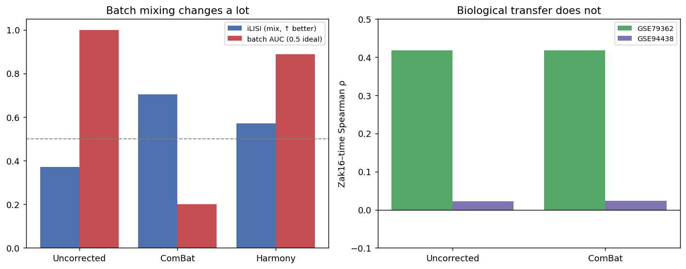

# Design Before Deep Learning: Disentangling Batch Effects, Comparator Shift and Site Heterogeneity in TB Transcriptomics

**English** | [中文](#中文说明)

A design-first analysis of two tuberculosis whole-blood cohorts, showing why batch correction alone cannot rescue a mis-specified cross-cohort comparison.

Cohorts: **GSE79362** (ACS adolescent cohort, Zak et al. 2016) and **GSE94438** (GC6-74 household contacts, Suliman et al. 2018).

---

## Key findings

1. The two cohorts have different control groups (latent infection versus exposed household contacts). They share no label that can be pooled, so a conventional cross-cohort supervised comparison is not available by design.

2. Random sample-level splitting never produces a clean split. In 2000 simulations per cohort, `P(clean split) = 0`. Donor-level splitting is a requirement, not an optimisation.

3. The Zak16 signature **discriminates progressors from non-progressors in all three cohorts** (AUC 0.68 to 0.87, all CIs above 0.5), including a third independent UK cohort (GSE107994). What varies is the **time gradient**: the score tracks time to diagnosis in GSE79362 (ρ = −0.449) but not GSE94438 (ρ = −0.022).

4. The three GSE94438 study sites are heterogeneous (Cochran's Q = 6.21, df = 2, p = 0.045, I² = 68%).

5. Site centering and ComBat leave the result essentially unchanged (ρ = −0.020 and −0.009). They adjust location and scale, and the problem appears as slope heterogeneity between sites.

6. The missing gradient in GSE94438 tracks its **sampling window** (median 426 versus 274 days from diagnosis), not a different gene programme: the interferon signal is active there but sampled largely before it rises. Four correction methods, up to a deep generative model, move batch mixing substantially while leaving the gradient at chance, because it is not a batch effect.

> Better batch mixing does not necessarily produce better biological transfer. A visually cleaner latent space may leave the scientific problem unchanged.

---

## Abstract

**Background.** When a transcriptomic result fails to reproduce across cohorts, batch effect is the usual explanation, and stronger correction methods are the usual response. That reasoning assumes the comparison was well specified to begin with.

**Methods.** We audited two TB whole-blood cohorts before fitting any model. The audit covered label compatibility, repeated-measures structure, leakage risk under random splitting, and the encoding of the time-to-diagnosis field. We then measured how a published 16-gene signature relates to time to diagnosis in each cohort, and tested whether site correction changes that relationship.

**Results.** The cohorts share no poolable supervised label: their negative classes are disjoint populations. Random sample-level splitting leaks donors in every one of 2000 simulations. Restricted to progressors with a usable time value, 168 samples from 108 donors remain. The signature tracks time to diagnosis in GSE79362 (ρ = −0.449) and not in GSE94438 (ρ = −0.022, 95% CI −0.25 to +0.21). Within GSE79362, using each donor as their own control gives a stronger association from fewer people (ρ = −0.493, p = 0.00018, 19 donors). Within GSE94438, the three sites are heterogeneous, and neither site centering nor ComBat moves the pooled estimate.

**Conclusion.** Not every cross-cohort failure is a batch effect. The signature discriminates progressors in all three cohorts; what fails in GSE94438 is only the within-progressor time gradient, and that tracks the cohort's sampling window rather than a different biology. Four correction methods up to a deep generative model improve batch mixing without moving the gradient. Comparator definition, sampling window and site-level biological heterogeneity are separate problems, and correction methods that adjust location and scale address only one of them. Study design should be audited before model capacity is increased.

---

## 1. Research question

Cross-cohort transcriptomic work often begins by merging datasets and correcting for batch. That order assumes the merged comparison is meaningful. This project asks what happens when the assumption is checked first.

Four sources of cross-cohort discrepancy are worth separating:

| Source | What it is | Can location/scale correction address it? |
|---|---|---|
| Technical batch effect | Platform, laboratory, processing differences | Yes, this is what it is designed for |
| Comparator shift | "Control" means different populations in different cohorts | No, the confound is in the label |
| Timeline shift | Cohorts sample different parts of a disease course | No, but it can be handled by restricting the range |
| Site heterogeneity | The biological relationship itself differs between settings | No, if the difference is in slope rather than offset |

All four look similar in a PCA plot. They require different responses.

---

## 2. Datasets and study design

Metadata and expression were obtained through the `curatedTBData` Bioconductor package. Counts were filtered at CPM > 1 in at least 20 samples and converted to log-CPM.

| | GSE79362 | GSE94438 | GSE107994 |
|---|---|---|---|
| Cohort | ACS adolescents, single site | GC6-74 household contacts, three sites | Leicester adult contacts, UK |
| Samples | 355 | 434 | 175 |
| Donors | 144 | 334 | 161 |
| Progressor donors | 33 | 75 | **9** |
| Negative class | **LTBI** | **Household contact** | **LTBI** |
| Time to diagnosis | continuous | continuous | binned text only |
| Genes after filtering | 18,608 | 16,196 | 16,543 |

Shared genes across the first two cohorts: 15,264. Across all three: **14,257**.

GSE107994 is a third, independent cohort (UK adult LTBI contacts) added to test whether the signature's behaviour generalises. Its progressor count is small (9 donors) and it lacks a continuous time-to-diagnosis field, so it is used only for the discrimination question (section 7.0), not for the time gradient.

The sibling repository [TB-Whole-Blood-Transcriptomics-GSE79362-GSE94438](https://github.com/melodysum/TB-Whole-Blood-Transcriptomics-GSE79362-GSE94438) reports 14,128 shared genes from the same cohorts. The difference is the filtering rule, not the data.

---

## 3. Design audit

Everything in this section derives from metadata alone. No expression values are needed, and each result constrains what the analysis is allowed to claim. Reproduce with `scripts/run_audit.py`; full output in [`results/design_audit.md`](results/design_audit.md).

### 3.1 Batch is not confounded with label

Cramér's V between the technical variable and the biological label is 0.072 for study and 0.069 for site within GSE94438. Both are negligible.

This matters because adversarial batch removal has a precondition. If batch determined the label, the data would contain no counter-examples, and any method that erased batch would erase biology with it. That situation does not apply here.

### 3.2 The cohorts share no poolable label

The negative classes are disjoint: 245 LTBI subjects in GSE79362, 327 household contacts in GSE94438, with no overlap. Study therefore determines what "control" means. A pooled classifier can reach the right answer for the wrong reason, and no batch correction can help, because the confound is in the label definition rather than in the expression values.

Both cohorts also carry a `Progression` column, which looks like an alternative axis. It is not. Inside each cohort it is exactly collinear with `TBStatus`: every off-diagonal count is zero. It is a relabelling, and it renames two different control populations to the same string. `audit.independent_axes()` detects this by measuring collinearity rather than reading a configuration field.

### 3.3 Donor leakage is certain under random splitting

| | GSE79362 | GSE94438 |
|---|---|---|
| Donors on both sides, mean of 2000 random 80/20 splits | 47.7 | 27.8 |
| Range | 35 to 60 | 14 to 42 |
| P(clean split) | **0.000** | **0.000** |
| Effective sample size inflation | 2.47× | 1.28× |

Not one clean split in 2000 draws. On GSE79362 the effective sample size is 144 people, not 355 samples.

The same repeated-measures structure reduced the strict differential-expression count from 30 to 9 in the sibling analysis once `duplicateCorrelation` (ρ ≈ 0.31) accounted for it. `splits.py` enforces the constraint by assertion: a leaking split raises rather than returning a score.

### 3.4 Cleaning the time axis

`TimeToTB` is stored as free text and needs three corrections before use.

**Units differ.** GSE79362 records days ("642 Day(s)"), GSE94438 records months ("22 month(s)"). Both are converted to days at 30.4375 days per month.

**One missing-value code is not `NA`.** GSE79362 uses the literal string `"---"`, for which `is.na()` returns FALSE. There are 166 such rows, all belonging to non-progressors. True missingness is 257 of 355, not the 91 that `is.na()` reports.

**Some times are negative.** Values such as "−91 Day(s)" indicate samples drawn after diagnosis, which is prevalent disease rather than early progression. These are excluded.

After cleaning, both cohorts populate the field for progressors only:

| Step | GSE79362 (samples/donors) | GSE94438 (samples/donors) |
|---|---|---|
| Progressors | 110 / 40 | 101 / 75 |
| With a parseable time | 98 / 33 | 101 / 75 |
| Excluding days < 0 | 85 / 33 | 101 / 75 |
| Excluding days = 0 | **67 / 33** | **101 / 75** |

Final analysis set: **168 samples from 108 donors**.

### 3.5 The cohorts sample different parts of the timeline

| Cohort | n | Min | Median | Max |
|---|---|---|---|---|
| GSE79362 | 67 | 4 | 274 | 894 |
| GSE94438 | 101 | 91 | 426 | 730 |

GSE94438 samples sit further from diagnosis, and its window never opens closer than 91 days. Since progression signal is expected to strengthen as diagnosis approaches, this is covariate shift on the target variable. Restricting both cohorts to the overlap window [91, 730] days leaves 150 samples from 105 donors, and all analyses below are reported for both ranges.

### 3.6 Repeated sampling differs between the cohorts

| Cohort | Donors with >1 sample | Donors with >1 distinct time | Median within-donor spread |
|---|---|---|---|
| GSE79362 | 19 | 19 | 360 days |
| GSE94438 | 20 | **0** | not applicable |

Every GSE94438 donor with repeated samples has a within-donor time spread of exactly zero. Those are replicates at one timepoint, not longitudinal sampling. Only GSE79362 supports a within-person analysis.

### 3.7 Analysis protocol

Leave-one-study-out (LOSO) as the outer split, since that is the only arrangement in which the test batch was never seen. Donor-grouped stratified 5-fold within the training pool as the inner split. Minibatches balanced across cohorts. All splits validated by assertion.

---

## 4. Main results on real expression data

Uncorrected log-CPM, progressors only, days > 0, aggregated to one row per donor. Signature definitions are taken verbatim from the sibling analysis. Negative ρ means the score rises as diagnosis approaches, the direction the signature literature predicts. Reproduce with `scripts/run_baseline.py`; output in [`results/baseline_timeaxis.md`](results/baseline_timeaxis.md).

### 4.1 The association holds in one cohort and not the other

| Cohort | Signature | Donors | ρ | 95% CI | p |
|---|---|---|---|---|---|
| GSE79362 | Zak16 | 33 | −0.449 | −0.69 to −0.13 | 0.009 |
| GSE79362 | Eleven_gene | 33 | −0.426 | −0.67 to −0.10 | 0.014 |
| GSE94438 | Zak16 | 75 | −0.022 | −0.25 to +0.21 | 0.85 |
| GSE94438 | Eleven_gene | 75 | −0.025 | −0.25 to +0.21 | 0.85 |

Restricting to the overlap window changes little (−0.423 and −0.022), so timeline shift does not account for the difference. The GSE94438 null is not simply underpowered: at 75 donors the confidence interval excludes any association stronger than |ρ| = 0.25.

### 4.2 Using each donor as their own control gives a stronger signal

| Cohort | Longitudinal donors | Within-donor ρ | p | Between-donor ρ | p |
|---|---|---|---|---|---|
| GSE79362 | 19 | −0.493 | 0.00018 | −0.449 | 0.009 |
| GSE94438 | 0 | not available | | −0.022 | 0.85 |

Centring both variables inside each donor removes individual baseline expression. The result is a stronger association from fewer people, with a p-value two orders of magnitude smaller. GSE94438 contributes no longitudinal donors, so this analysis is unavailable there.

### 4.3 The GSE94438 sites are heterogeneous

| Site | Donors | ρ | p |
|---|---|---|---|
| Ethiopia | 11 | −0.563 | 0.071 |
| The Gambia | 25 | −0.279 | 0.18 |
| South Africa | 39 | +0.196 | 0.23 |
| Pooled | 75 | −0.022 | 0.85 |

Cochran's Q = 6.21, df = 2, p = 0.045, I² = 68%. No site reaches significance alone, but they differ by more than sampling noise would explain, and the largest site points the other way. Site sampling windows are comparable (median 244, 335 and 335 days), so timeline shift does not explain the site differences either.

---

## 5. Why conventional batch correction did not help

Run before writing any encoder. If a one-line linear correction works, a neural method must beat it. If no correction can work, the batch-removal framing is the wrong one. Reproduce with `scripts/run_site_correction.py`; output in [`results/site_correction.md`](results/site_correction.md).

| Method | Pooled ρ | p |
|---|---|---|
| Uncorrected | −0.022 | 0.85 |
| Site-wise gene centering | −0.020 | 0.86 |
| ComBat, site as batch | −0.009 | 0.94 |
| GSE79362 estimate for reference | −0.449 | |

The per-site correlations are also unchanged: −0.563, +0.196 and −0.279 become −0.563, +0.192 and −0.274.

### Why

Spearman correlation depends only on ranks, so it is unchanged by any transformation that preserves order within a group. Applying arbitrary affine maps to one site's scores illustrates this:

| Transformation | ρ |
|---|---|
| `1.0 × score + 0.0` | +0.196420 |
| `3.7 × score + 2.1` | +0.196420 |
| `0.2 × score + 100.0` | +0.196420 |

Centering subtracts a per-site constant. ComBat applies a per-site location and scale adjustment. Both preserve within-site order, so neither can change a within-site rank correlation. Once per-site offsets are removed, the pooled value is largely determined by the within-site values.

The observed problem is heterogeneity in the direction of the relationship, not in its offset. Correction methods that adjust location and scale do not address that.

---

## 6. Implications for modelling

The adversarial components in this repository run on synthetic data only. The autoencoder has now been evaluated on the TB cohorts as part of the time-supervised experiment below, where it did not improve on a fixed signature.

Two results bear on how they should be developed.

**An adversarial objective is not aimed at this failure.** Adversarial training optimises for making batches indistinguishable. The cheapest route to that objective is removing per-site location and scale, which is what ComBat does, and which changed nothing here. To help, an encoder would need to learn a transformation that reorders samples within a site, and the adversarial objective does not encourage that.

**A linear baseline is competitive on the synthetic task.** On synthetic data a plain autoencoder does not remove batch at all: a linear probe recovers batch from its latent with accuracy 1.00. A one-line `removeBatchEffect` reduces that to 0.37. Any additional machinery has to beat that baseline before it is worth the complexity.

### 6.1 Result: a fixed signature beats every fitted model

Section 5 pointed to giving the encoder the time axis as an explicit objective instead. That experiment has now been run. Four arms of increasing capacity, evaluated by donor-level Spearman rho between predicted and observed days-to-diagnosis. Reproduce with `scripts/run_time_encoder.py`; output in [`results/time_encoder.md`](results/time_encoder.md).

Within GSE79362, donor-grouped 5-fold cross-validation, 33 donors:

| Arm | Fitted parameters | rho |
|---|---|---|
| A Zak16 signature | **none** | **+0.417** |
| B Ridge on 2000 HVGs | ~2,000 | +0.331 |
| D Autoencoder + joint time head | ~10^5 | +0.317 |
| C Autoencoder latent + ridge head | ~10^5 | +0.194 |

Cross-cohort, leave-one-study-out:

| Arm | Train 94438, test 79362 | Train 79362, test 94438 |
|---|---|---|
| A Zak16 signature | **+0.417** | +0.022 |
| B Ridge on 2000 HVGs | −0.110 | −0.094 |
| C Autoencoder latent + ridge | −0.290 | −0.079 |
| D Autoencoder + time head | +0.007 | −0.101 |

Two patterns, both clean.

**Performance falls as capacity rises.** Within-cohort, the ordering is A > B > D > C, and the zero-parameter arm wins. A published signature encodes accumulated prior knowledge that 33 donors cannot re-derive from 15,264 genes.

**Every fitted method fails on transfer.** Five of six cross-cohort estimates are negative, meaning predictions run against the true ordering rather than merely failing to track it. Arm A transfers unchanged because it is never fitted.

This is a sample-size result rather than a verdict on any architecture. It also matches what the audit predicted: the target relationship is absent in GSE94438 (section 4.1), so training there cannot learn it, and 33 donors in GSE79362 is too small a base to generalise from.

Note on arm A: rho is +0.417 here against −0.449 in section 4, because the sign is flipped so that higher means later, and because the shared gene space excludes `FCGR1B`, leaving 15 of 16 genes.

### 6.2 What would need to change

More cohorts, not more capacity. Nothing in these results suggests the architecture is at fault; they suggest 108 labelled donors across two cohorts is below the threshold at which representation learning helps on this target. Adding independent progressor cohorts is the only change that alters that arithmetic.

### Synthetic modelling notes

Three attempts at adversarial correction on synthetic data, recorded because the failure modes are informative.

A single-optimiser gradient-reversal setup left batch accuracy at 0.997 and the triplet loss at zero from the start. The synthetic batch effect was strong and low-rank, and the synthetic biological groups were separable enough that the triplet margin was satisfied immediately.

Raising the adversarial weight to λ = 8 with five discriminator steps per encoder step caused divergence: reconstruction loss rose to 6.1 and batch silhouette reached 0.97.

After stabilising (λ = 1.5, one discriminator step, gradient clipping, triplet computed on L2-normalised latents), training was stable and discriminator accuracy fell from 0.88 to chance. A logistic probe fitted afterwards still recovered batch with accuracy 1.00. Fooling one discriminator is not the same as removing batch information from a representation, which is why metrics such as iLISI and kBET, or explicit distribution matching, are preferred in the integration literature.

Practical notes: use LayerNorm rather than BatchNorm in the encoder, since BatchNorm statistics can reintroduce batch identity when minibatches are cohort-imbalanced; ramp the adversarial weight from zero; normalise latents before computing distances.

---

## 7. What actually fails, and why no correction reaches it

Sections 4 to 6 reported that the Zak16 signature "fails to transfer" to GSE94438. A third cohort and a second metric show that phrase was too broad. The signature does two different jobs, and only one of them fails.

### 7.0 Two questions, not one

A signature can be asked to **discriminate** progressors from non-progressors, or to track a **time gradient** within progressors as diagnosis approaches. These are different questions, and separating them across three cohorts changes the conclusion. Reproduce with `scripts/run_two_questions.py`; output in [`results/two_questions.md`](results/two_questions.md).

| cohort | population | discrimination AUC | 95% CI | time-gradient ρ |
|---|---|---|---|---|
| GSE79362 | South African adolescent LTBI | 0.791 | [0.70, 0.87] | +0.417 (n=33) |
| GSE94438 | African adult household contacts | 0.678 | [0.60, 0.75] | +0.022 (n=75) |
| GSE107994 | UK adult LTBI contacts | 0.871 | [0.76, 0.95] | not available |

The signature **discriminates progressors in all three cohorts**, GSE94438 included: its AUC is 0.68 with a confidence interval entirely above 0.5. What is absent in GSE94438 is the **time gradient** — the score does not rise as diagnosis approaches. The earlier sections measured only the gradient and called its absence a transfer failure; with discrimination measured too, the failure is narrower and more specific.

GSE107994 (added as an independent third cohort) has no continuous time-to-diagnosis field, so the gradient cannot be computed there. Its role is to confirm that discrimination is not a two-cohort coincidence: a UK adult contact cohort, different from both a South African adolescent cohort and African adult contacts, gives the strongest discrimination of the three.

### 7.1 The gradient failure is not gene reprogramming — it tracks the sampling window

An earlier version of this section concluded that GSE94438 uses a different gene programme, on the basis that the per-gene time-correlations do not reproduce (Spearman −0.10). That analysis is correct but was over-interpreted: gene-level time-correlations are noisy at these sample sizes, and discrimination shows the interferon programme is in fact active in GSE94438. The more parsimonious reading is in section 3.5: GSE94438 samples systematically further from diagnosis (median 426 versus 274 days, never closer than 91 days). The signature's time gradient is a near-diagnosis phenomenon, and GSE94438 is largely sampled before it appears. This is timeline shift (a covariate-shift problem), not a batch effect and not a different biology. Reproduce with `scripts/run_reproduction.py` and `scripts/run_corrections.py`; outputs in [`results/reproduction.md`](results/reproduction.md) and [`results/corrections.md`](results/corrections.md).

### 7.2 Per-gene time-correlations do not reproduce, but this is noisy

Correlating each gene with time in each cohort separately, then correlating the two gene-wise correlation vectors, gives Spearman −0.10 across 15,264 genes. The 200 genes most associated with time in GSE79362 have mean |ρ| = 0.50 there and 0.10 in GSE94438, with sign agreement 31%.

At the level of the time gradient, the individual genes do not carry the same information in the two cohorts. This is real but, per 7.1, reflects where each cohort sits on the disease timeline rather than a different gene programme. Each Zak16 gene:

| gene | GSE79362 | GSE94438 |
|---|---|---|
| GBP5 | −0.482 | −0.094 |
| ANKRD22 | −0.533 | −0.011 |
| BATF2 | −0.401 | +0.003 |
| IFIT3 | −0.408 | −0.008 |

Every interferon gene that tracks *time* in GSE79362 flattens toward zero in GSE94438. This is a statement about the gradient only; per 7.0 the same genes still discriminate GSE94438 progressors.

### 7.4 Window-matching does not restore per-gene reproduction

One qualification to 7.1. The timeline-shift reading explains the missing *gradient*, but it does not by itself make the per-gene time-correlation *vectors* agree: restricting both cohorts to a shared early window leaves gene-level reproduction low (Spearman −0.17 within 0–365 days, −0.27 within 0–270 days). This is consistent with 7.2 — per-gene time-correlations are noisy at these donor counts, so the vectors need not align even when the aggregate signature discriminates. Discrimination (7.0) is the robust, well-powered result; per-gene reproduction is not, and should not be over-read in either direction.

### 7.5 GSE94438's strongest time-genes differ (gradient, not discrimination)

The genes most correlated with time in GSE94438 are TPM4, MYZAP, SPAG1 and similar, not the interferon programme of the published signature. Each cohort has a time signal; the signals occupy different gene programmes. This is consistent with different progression biology in an adolescent latent-infection cohort versus adult household contacts across three African sites, and it is not something batch correction can reach, because there is no shared signal to preserve.

### 7.6 Four correction methods confirm the gradient is not batch-reachable

Each method is scored on batch mixing and on biological transfer at the same time. Mixing asks whether the cohorts are still distinguishable; transfer is the Zak16–time correlation that actually matters.

| method | type | iLISI (mix) | batch AUC | GSE79362 transfer | GSE94438 transfer |
|---|---|---|---|---|---|
| Uncorrected | — | 0.372 | 1.000 | +0.417 | +0.022 |
| ComBat | linear | 0.703 | 0.201 | +0.418 | +0.023 |
| Harmony | non-linear (embedding) | 0.571 | 0.889 | embedding only | embedding only |
| scVI | deep generative | 0.212 | 0.995 | +0.393 | +0.033 |



ComBat moves the batch probe from perfect separation to near-chance while GSE94438 transfer moves by 0.001. Across all four methods, from a one-line linear adjustment to a deep generative model, GSE94438 transfer never leaves chance. This is the decoupling stated at the top of the README, now measured: batch mixing and biological transfer are separate axes, and improving the first does not move the second when the cohorts share no signal to begin with.

## 8. Limitations

Site strata are small, between 11 and 39 donors, and the site decomposition was not planned in advance. Q = 6.21 at p = 0.045 justifies the next experiment rather than settling the question. South Africa's ρ = +0.196 has a bootstrap 95% CI of −0.121 to +0.482, which crosses zero. Leave-one-out is stable (+0.162 to +0.258), so it is not driven by a single donor, but the claim that sites point in opposite directions remains suggestive.

`FCGR1B` is absent from the GSE94438 matrix, so its Zak16 and Eleven_gene scores use one gene fewer. The sibling analysis has the same limitation.

The progressor time axis has 108 donors, which is enough to test a moderate association but not to fit an encoder. At 33 donors, power to detect ρ = 0.4 is 0.64; at 75 donors it is 0.95.

Whether the missing GSE94438 gradient reflects the sampling window alone, or also some genuine between-setting difference, cannot be settled with the cohorts available here.

The cohort search was exhausted rather than left open. All 50 studies in curatedTBData were screened. Exactly two carry both a progression label and a continuous time-to-diagnosis field: GSE79362 and GSE94438, both included. GSE107994 has a progression label but only 9 progressor donors and no continuous time, so it serves the discrimination question only (section 7.0). Other longitudinal-looking studies (GSE84076, GSE107104, GSE107991, GSE107992) lack a progression label entirely. Adding a fourth cohort with continuous time therefore requires raw GEO data outside the curatedTBData collection, with the per-study metadata cleaning that this project's audit layer was built to handle but which was not attempted here. That is the single most useful extension, and it is a data-acquisition task, not a modelling one.

---

## 9. Reproducibility

```bash
pip install -r requirements.txt

python scripts/run_audit.py --registry configs/studies.yaml --root .
python -m pytest tests/ -q
```

Expression matrices are not committed. Regenerate them with the R snippet in [`data/expr/README.md`](data/expr/README.md), then:

```bash
python scripts/run_baseline.py
python scripts/run_site_correction.py
```

| Script | Produces |
|---|---|
| `scripts/run_audit.py` | `results/design_audit.md` (section 3) |
| `scripts/run_baseline.py` | `results/baseline_timeaxis.md` (section 4) |
| `scripts/run_site_correction.py` | `results/site_correction.md` (section 5) |
| `scripts/run_time_encoder.py` | `results/time_encoder.md` (section 6.1) |
| `scripts/run_two_questions.py` | `results/two_questions.md` (section 7.0) |
| `scripts/scout_cohorts.R` | screens all curatedTBData studies for a usable time axis (Limitations) |
| `scripts/run_reproduction.py` | `results/reproduction.md` (sections 7.2-7.5) |
| `scripts/run_corrections.py` | `results/corrections.md`, `results/decoupling.png` (section 7.4) |
| `scripts/run_scvi.py` | `results/scvi.md` (section 7.4, needs raw counts) |

| Module | Role |
|---|---|
| `configs/studies.yaml` | Study registry: column mappings and label-axis definitions |
| `src/tbbatch/metadata.py` | Schema harmonisation; refuses to pool cohorts with disjoint control definitions |
| `src/tbbatch/audit.py` | Cramér's V, leakage simulation, collinear-axis detection |
| `src/tbbatch/splits.py` | LOSO and donor-grouped splitters, validated by assertion |
| `src/tbbatch/timeaxis.py` | Time parsing, unit harmonisation, sentinel handling, power calculation |
| `ae_bulk.py`, `ae_adv_triplet.py` | Autoencoder and adversarial demonstrations, synthetic data only |

The test suite has 21 tests. Several construct leaking splits or misencoded time values on purpose and assert that the guards fire.

---

## 10. Status and next steps

| Item | Status |
|---|---|
| Design audit on real metadata | Complete |
| LOSO and donor-grouped splitters | Complete |
| Time axis parsing and cleaning | Complete |
| Signature versus time baseline | Complete |
| Site correction test | Complete |
| Time-supervised encoder under LOSO | Complete, negative (section 6.1) |
| Correction comparison: ComBat / Harmony / scVI with decoupling metrics | Complete (section 7.4) |
| Third cohort GSE107994 for discrimination check | Complete (section 7.0) |
| Additional continuous-time cohorts | Exhausted within curatedTBData; requires raw GEO (see Limitations) |
| Adversarial and triplet on real data | Deprioritised, see section 5 |

---

## Appendix: development and validation notes

Six claims were made during development, checked against the data, and withdrawn. They are recorded because each retraction narrowed what these cohorts can support.

| Claim | Check | Outcome |
|---|---|---|
| Published-signature AUC 0.77 versus 0.69 measures cross-cohort transfer loss | Read the source results file | The signatures were scored within each cohort separately against different comparators. No transfer experiment existed. |
| Batch is confounded with label in these cohorts | Cramér's V on real metadata | 0.072, negligible. The justification was removed. |
| The `Progression` axis solves the disjoint-control problem | Cross-tabulate against `TBStatus` | Exactly collinear inside both cohorts. A relabelling, not a new axis. |
| 166 GSE94438 negatives carry follow-up times, so the data are right-censored | Count the `"---"` sentinel | All 166 are the sentinel. Neither cohort records censoring times. |
| GSE94438 has 76 progressor donors | Recount from the parsed metadata | 75. In R, `x[cond]` returns `NA` rows where `cond` is `NA`, and `unique()` counted `NA` as a donor. |
| GSE94438 supports a within-person contrast | Within-donor time spread | All 20 multi-sample donors have a spread of exactly zero. |

Several of these share a pattern: a summary statistic was trusted where the underlying rows had not been inspected. Entry 7 is different and worth its own note: it was not a coding error but an interpretive one, corrected only when a third cohort and a second metric were brought in. A single-cohort, single-metric result invited an over-confident mechanistic story; the fix was more data and a second question, not a better guard. Two of them were caught by code that had already been written but was not run on the data. The design rule that follows is that a guard depending on correct manual annotation, or one that can be bypassed by reading raw output, is not a guard. `independent_axes()` therefore measures collinearity rather than reading a configuration field, and `audit_series()` reports a category per row rather than a missingness count.

A fuller development record is preserved in [`docs/README_v1_development_log.md`](docs/README_v1_development_log.md).

---

## References

- Zak et al. 2016, *Lancet*: GSE79362
- Suliman et al. 2018, *AJRCCM*: GSE94438
- Ganin & Lempitsky, *Domain-Adversarial Training of Neural Networks*
- Hermans et al., *In Defense of the Triplet Loss for Person Re-Identification*
- Luecken et al., *Benchmarking atlas-level data integration*
- Johnson et al., *Adjusting batch effects in microarray expression data using empirical Bayes methods* (ComBat)
- Bergsma, *A bias-correction for Cramér's V and Tschuprow's T*

---
---

<a name="中文说明"></a>

**[English](#design-before-deep-learning-disentangling-batch-effects-comparator-shift-and-site-heterogeneity-in-tb-transcriptomics)** | 中文

# 先检查研究设计，再使用深度学习：区分结核转录组中的批次效应、对照人群差异和站点异质性

对两个结核全血队列做的设计优先分析，说明为什么单靠批次校正救不回一个设定本身就有问题的跨队列比较。

队列：**GSE79362**（ACS 青少年队列，Zak et al. 2016）与 **GSE94438**（GC6-74 家庭密接，Suliman et al. 2018）。

---

## 主要结论

1. 两个队列的对照组不是同一类人（潜伏感染 vs 暴露的家庭密接）。它们没有可以合并的共同标签，所以常规的跨队列有监督比较在设计上就不成立。

2. 按样本随机划分永远得不到干净的划分。每个队列各做 2000 次模拟，`P(clean split) = 0`。按 donor 划分是硬性要求，不是可选的优化。

3. Zak16 signature **在三个队列都能区分 progressor 与 non-progressor**（AUC 0.68 至 0.87，CI 全在 0.5 以上），包括第三个独立的英国队列（GSE107994）。变化的是**时间梯度**：得分在 GSE79362 中追踪到确诊时间（ρ = −0.449），在 GSE94438 中不追踪（ρ = −0.022）。

4. GSE94438 的三个研究站点之间存在异质性（Cochran's Q = 6.21，df = 2，p = 0.045，I² = 68%）。

5. 站点内中心化和 ComBat 基本没有改变结果（ρ = −0.020 与 −0.009）。它们校正的是位置和尺度，而当前问题表现为站点之间的斜率差异。

6. GSE94438 缺失的梯度跟着它的**采样窗口**走（中位 426 对 274 天），而不是不同的基因程序：干扰素信号在那里是活跃的，只是大部分采样在它上升之前。四种校正方法，直到深度生成模型，都大幅改善批次混合，却让梯度停在随机水平——因为它不是批次效应。

> 批次混合得更好，不等于生物学迁移更好。潜空间看起来更整齐，科学问题可能一点没变。

---

## 摘要

**背景。** 转录组结果跨队列复现不了时，常见的解释是批次效应，常见的对策是用更强的校正方法。这个推理假设了比较本身设定得当。

**方法。** 在拟合任何模型之前，先对两个结核全血队列做设计审计，内容包括标签兼容性、重复测量结构、随机划分下的泄漏风险，以及「到确诊时间」字段的编码方式。随后测量一个已发表的 16 基因 signature 在各队列中与到确诊时间的关系，并检验站点校正能否改变这一关系。

**结果。** 两个队列没有可合并的有监督标签，因为它们的负类是完全不重叠的人群。按样本随机划分在 2000 次模拟中每次都泄漏 donor。限定在有可用时间值的 progressor 后，剩下 108 个 donor 的 168 个样本。Signature 在 GSE79362 中追踪到确诊时间（ρ = −0.449），在 GSE94438 中不追踪（ρ = −0.022，95% CI −0.25 至 +0.21）。在 GSE79362 内部，让每个人做自己的对照，用更少的人得到更强的关联（ρ = −0.493，p = 0.00018，19 个 donor）。GSE94438 的三个站点之间存在异质性，而站点中心化和 ComBat 都没有移动合并估计值。

**结论。** 不是每一次跨队列失败都是批次效应。signature 在三个队列都能区分 progressor；GSE94438 失败的只是 progressor 内部的时间梯度，而它跟着队列的采样窗口走，不是不同的生物学。四种校正方法直到深度生成模型都在改善批次混合而不移动梯度。对照组定义、采样窗口和站点层面的生物学异质性是彼此独立的问题，而调整位置和尺度的校正方法只处理其中一个。在增加模型容量之前，应当先审计研究设计。

---

## 一、研究问题

跨队列转录组分析通常一上来就合并数据集再做批次校正。这个顺序默认合并后的比较是有意义的。本项目的做法是先检验这个前提。

跨队列差异至少有四个来源，值得分开看：

| 来源 | 含义 | 位置/尺度校正能处理吗 |
|---|---|---|
| 技术批次效应 | 平台、实验室、处理流程差异 | 可以，这正是它的设计目标 |
| 对照人群差异 | 不同队列的「对照」是不同人群 | 不能，混杂在标签里 |
| 时间轴偏移 | 队列采样于病程的不同区段 | 不能，但可以靠限制范围处理 |
| 站点异质性 | 生物学关系本身在不同地区就不同 | 若差异在斜率而非偏移，则不能 |

这四种在 PCA 图上看起来差不多，需要的对策却完全不同。

---

## 二、数据与研究设计

Metadata 与表达数据通过 `curatedTBData` 获取。counts 按「至少 20 个样本 CPM > 1」过滤后转为 log-CPM。

| | GSE79362 | GSE94438 | GSE107994 |
|---|---|---|---|
| 队列 | ACS 青少年，单站点 | GC6-74 家庭密接，三站点 | Leicester 成人密接，英国 |
| 样本数 | 355 | 434 | 175 |
| Donor 数 | 144 | 334 | 161 |
| Progressor donor | 33 | 75 | **9** |
| 阴性类 | **LTBI** | **家庭密接** | **LTBI** |
| 到确诊时间 | 连续 | 连续 | 仅文本分箱 |
| 过滤后基因数 | 18,608 | 16,196 | 16,543 |

前两个队列共享基因：15,264。三个队列共享：**14,257**。

GSE107994 是加入的第三个独立队列（英国成人 LTBI 密接），用于检验 signature 的行为是否可推广。它的 progressor 数少（9 个 donor）且没有连续到确诊时间字段，因此只用于判别问题（7.0 节），不用于时间梯度。

姊妹仓库 [TB-Whole-Blood-Transcriptomics-GSE79362-GSE94438](https://github.com/melodysum/TB-Whole-Blood-Transcriptomics-GSE79362-GSE94438) 用同样的队列报告了 14,128 个共享基因。差异来自过滤规则，不是数据本身。

---

## 三、设计审计

本节全部结论只依赖 metadata，不需要任何表达值，而且每一条都约束了后续分析能宣称什么。用 `scripts/run_audit.py` 复现，完整输出见 [`results/design_audit.md`](results/design_audit.md)。

### 3.1 批次与标签并未混杂

技术变量与生物标签之间的 Cramér's V：study 为 0.072，GSE94438 内部的 site 为 0.069，都属于可忽略的量级。

这一点要紧，因为对抗式去批次有一个前提：如果批次决定了标签，数据里就没有反例，任何能抹掉批次的方法都会连生物信号一起抹掉。这个情形在这里不成立。

### 3.2 两个队列没有可合并的标签

负类完全不重叠：GSE79362 的 245 个 LTBI，GSE94438 的 327 个家庭密接，没有交集。因此 study 决定了「对照」是什么意思。合并训练的分类器可以「答案对、理由错」，而且批次校正帮不上忙，因为混杂在标签定义里，不在表达值里。

两个队列还都有 `Progression` 列，看上去像是另一个可用的轴。它不是。在每个队列内部它与 `TBStatus` 完全共线，交叉表 off-diagonal 全为 0。它只是一次改名，而且把两个不同的对照人群统一命名成了同一个字符串。`audit.independent_axes()` 通过实测共线性来检出这种情况，而不是读配置文件里的声明。

### 3.3 随机划分下 donor 泄漏是必然的

| | GSE79362 | GSE94438 |
|---|---|---|
| 2000 次随机 80/20 划分中两侧共享的 donor 均值 | 47.7 | 27.8 |
| 范围 | 35 至 60 | 14 至 42 |
| P(干净划分) | **0.000** | **0.000** |
| 有效样本量虚增 | 2.47× | 1.28× |

2000 次抽样没有一次干净。GSE79362 的有效样本量是 144 个人，不是 355 个样本。

同样的重复测量结构，在姊妹分析里用 `duplicateCorrelation`（ρ ≈ 0.31）纳入模型后，把严格差异表达基因数从 30 降到了 9。`splits.py` 用断言强制这个约束：泄漏的划分会直接抛异常，而不是返回一个分数。

### 3.4 清洗时间轴

`TimeToTB` 是自由文本，使用前需要三处修正。

**单位不同。** GSE79362 记天（"642 Day(s)"），GSE94438 记月（"22 month(s)"）。统一按 30.4375 天/月换算为天。

**有一个缺失标记不是 `NA`。** GSE79362 用字面字符串 `"---"`，`is.na()` 对它返回 FALSE。这样的行有 166 个，全部属于非进展者。真实缺失是 355 中的 257，而不是 `is.na()` 报告的 91。

**部分时间为负。** 例如 "−91 Day(s)"，表示确诊之后采集的样本，属于现患疾病而非早期进展，予以排除。

清洗后，两个队列都只对 progressor 填充该字段：

| 步骤 | GSE79362（样本/donor） | GSE94438（样本/donor） |
|---|---|---|
| Progressor | 110 / 40 | 101 / 75 |
| 时间可解析 | 98 / 33 | 101 / 75 |
| 排除 days < 0 | 85 / 33 | 101 / 75 |
| 排除 days = 0 | **67 / 33** | **101 / 75** |

最终分析集：**108 个 donor 的 168 个样本**。

### 3.5 两个队列采样于时间轴的不同区段

| 队列 | n | 最小 | 中位数 | 最大 |
|---|---|---|---|---|
| GSE79362 | 67 | 4 | 274 | 894 |
| GSE94438 | 101 | 91 | 426 | 730 |

GSE94438 的样本离确诊更远，其窗口最近只到 91 天。由于进展信号预期随确诊临近而增强，这构成目标变量上的协变量漂移。把两个队列都限制到重叠窗口 [91, 730] 天后，剩 105 个 donor 的 150 个样本；下面所有分析都同时报告两个范围。

### 3.6 两个队列的重复采样性质不同

| 队列 | 有多个样本的 donor | 有多个不同时间点的 donor | 个体内跨度中位数 |
|---|---|---|---|
| GSE79362 | 19 | 19 | 360 天 |
| GSE94438 | 20 | **0** | 不适用 |

GSE94438 中每一个有重复样本的 donor，其个体内时间跨度都恰好为零。那是单一时间点的重复样本，不是纵向采样。只有 GSE79362 支持个体内分析。

### 3.7 分析协议

外层用留一队列（leave-one-study-out，LOSO），因为只有这种安排下测试批次是模型从未见过的。内层在训练池内部用按 donor 分组的分层 5 折。Minibatch 在队列间均衡采样。所有划分都经断言验证。

---

## 四、真实表达数据上的主要结果

未校正 log-CPM，仅 progressor，days > 0，聚合到每个 donor 一行。Signature 定义直接取自姊妹分析。ρ 为负表示得分随确诊临近而升高，正是 signature 文献预测的方向。用 `scripts/run_baseline.py` 复现，输出见 [`results/baseline_timeaxis.md`](results/baseline_timeaxis.md)。

### 4.1 关系在一个队列成立，在另一个不成立

| 队列 | Signature | Donor | ρ | 95% CI | p |
|---|---|---|---|---|---|
| GSE79362 | Zak16 | 33 | −0.449 | −0.69 至 −0.13 | 0.009 |
| GSE79362 | Eleven_gene | 33 | −0.426 | −0.67 至 −0.10 | 0.014 |
| GSE94438 | Zak16 | 75 | −0.022 | −0.25 至 +0.21 | 0.85 |
| GSE94438 | Eleven_gene | 75 | −0.025 | −0.25 至 +0.21 | 0.85 |

限制到重叠窗口后变化很小（−0.423 与 −0.022），因此时间轴偏移解释不了这个差异。GSE94438 的零结果也不只是功效不足：在 75 个 donor 下，置信区间排除了任何强于 |ρ| = 0.25 的关联。

### 4.2 让每个人做自己的对照，信号更强

| 队列 | 纵向 donor | 个体内 ρ | p | 个体间 ρ | p |
|---|---|---|---|---|---|
| GSE79362 | 19 | −0.493 | 0.00018 | −0.449 | 0.009 |
| GSE94438 | 0 | 不可得 | | −0.022 | 0.85 |

在每个 donor 内部对两个变量做中心化，可以消去个体基线表达。结果是用更少的人得到更强的关联，p 值小两个数量级。GSE94438 没有纵向 donor，因此这项分析在那里不可得。

### 4.3 GSE94438 各站点存在异质性

| 站点 | Donor | ρ | p |
|---|---|---|---|
| Ethiopia | 11 | −0.563 | 0.071 |
| The Gambia | 25 | −0.279 | 0.18 |
| South Africa | 39 | +0.196 | 0.23 |
| 合并 | 75 | −0.022 | 0.85 |

Cochran's Q = 6.21，df = 2，p = 0.045，I² = 68%。单个站点都没有达到显著，但它们之间的差异超出抽样噪声可解释的范围，而且最大的那个站点方向相反。各站点的采样窗口可比（中位数分别为 244、335、335 天），所以时间轴偏移也解释不了站点差异。

---

## 五、为什么常规批次校正没有效果

这一步在写任何 encoder 之前完成。如果一行线性校正就有效，神经方法必须打赢它；如果任何校正都无效，那么 batch-removal 这个框架本身就不对路。用 `scripts/run_site_correction.py` 复现，输出见 [`results/site_correction.md`](results/site_correction.md)。

| 方法 | 合并 ρ | p |
|---|---|---|
| 未校正 | −0.022 | 0.85 |
| 站点内基因中心化 | −0.020 | 0.86 |
| ComBat（站点为批次） | −0.009 | 0.94 |
| GSE79362 参考值 | −0.449 | |

各站点的相关系数同样没变：−0.563、+0.196、−0.279 变成 −0.563、+0.192、−0.274。

### 原因

Spearman 相关只取决于秩，因此任何保持组内顺序的变换都不会改变它。对某一个站点的得分施加任意仿射变换即可看出：

| 变换 | ρ |
|---|---|
| `1.0 × score + 0.0` | +0.196420 |
| `3.7 × score + 2.1` | +0.196420 |
| `0.2 × score + 100.0` | +0.196420 |

中心化是减去一个站点内常数，ComBat 是站点内的位置与尺度调整。两者都保持站点内顺序，因此都不能改变站点内的秩相关。而一旦站点间偏移被消除，合并值基本上就由各站点内的值决定。

观察到的问题是关系方向上的异质性，不是偏移上的异质性。调整位置和尺度的校正方法不处理前者。

---

## 六、对建模的启示

本仓库中的对抗组件只在合成数据上运行。Autoencoder 已作为下面时间监督实验的一部分在结核队列上评估过，结果是没有超过固定 signature。

有两条结果影响后续开发方向。

**对抗目标不是针对这个失败的。** 对抗训练优化的是「让批次不可分辨」。达成这个目标最省力的路径是消除站点内的位置和尺度，那正是 ComBat 做的事，而它在这里什么也没改变。要起作用，encoder 需要学到一个能改变站点内样本顺序的变换，而对抗目标不鼓励这一点。

**在合成任务上线性基线已经很有竞争力。** 合成数据上，朴素 autoencoder 完全没有去掉批次：线性探针从它的潜表示中识别批次的准确率是 1.00。一行 `removeBatchEffect` 把这个数字降到 0.37。任何额外的机制都得先打赢这条基线，才谈得上值不值得增加复杂度。

### 6.1 结果：固定 signature 打败了所有拟合出来的模型

第五节指出的方向是把时间轴作为显式目标交给 encoder。这个实验已经做完。四个容量递增的 arm，指标是 donor 层面预测值与真实天数的 Spearman rho。用 `scripts/run_time_encoder.py` 复现，输出见 [`results/time_encoder.md`](results/time_encoder.md)。

GSE79362 内部，按 donor 分组的 5 折交叉验证，33 个 donor：

| Arm | 拟合参数量 | rho |
|---|---|---|
| A Zak16 signature | **零** | **+0.417** |
| B 2000 个 HVG 上的 Ridge | 约 2,000 | +0.331 |
| D Autoencoder + 联合时间头 | 约 10^5 | +0.317 |
| C Autoencoder 潜表示 + ridge 头 | 约 10^5 | +0.194 |

跨队列，留一队列：

| Arm | 训 94438 测 79362 | 训 79362 测 94438 |
|---|---|---|
| A Zak16 signature | **+0.417** | +0.022 |
| B 2000 个 HVG 上的 Ridge | −0.110 | −0.094 |
| C Autoencoder 潜表示 + ridge | −0.290 | −0.079 |
| D Autoencoder + 时间头 | +0.007 | −0.101 |

两个规律都很干净。

**容量越大，表现越差。** 队列内部的排序是 A > B > D > C，零参数的那一档赢了。一个已发表的 signature 编码了长期积累的先验知识，33 个 donor 无法从 15,264 个基因里把它重新推导出来。

**所有拟合过的方法在迁移上都失败了。** 六个跨队列估计中有五个为负，也就是说预测与真实顺序反向，而不只是没能追踪上。Arm A 因为从不拟合，迁移时数值不变。

这是一个样本量层面的结果，而不是对某种架构的判决。它也与审计的预测一致：目标关系在 GSE94438 中本就不存在（4.1 节），在那里训练学不到它；而 GSE79362 的 33 个 donor 也不足以支撑泛化。

关于 arm A 的说明：这里是 +0.417，第四节是 −0.449，差别在于符号被翻转成「越大表示越晚」，以及共享基因空间不含 `FCGR1B`，实际用了 16 个基因中的 15 个。

### 6.2 需要改变的是什么

是更多队列，不是更大容量。这些结果里没有任何东西指向架构问题；它们指向的是：两个队列合计 108 个标注 donor，低于表征学习在这个目标上能起作用的门槛。唯一能改变这个算术的是补充独立的 progressor 队列。

### 合成数据上的建模记录

在合成数据上做过三次对抗校正尝试，记录下来是因为失败模式本身有参考价值。

单优化器的梯度反转方案让批次准确率停在 0.997，triplet loss 从一开始就是零。原因是合成的批次效应又强又低秩，而合成的生物学分组过于容易区分，triplet 的 margin 一上来就满足了。

把对抗权重提到 λ = 8、判别器每轮更新五次后训练发散：重构损失升到 6.1，批次 silhouette 达到 0.97。

稳定化之后（λ = 1.5，判别器每轮一次，加梯度裁剪，triplet 在 L2 归一化的潜表示上计算），训练稳定，判别器准确率从 0.88 降到随机水平。但事后拟合的 logistic 探针仍以 1.00 的准确率识别批次。骗过一个判别器，不等于把批次信息从表示中去掉，这也是整合领域后来更倾向使用 iLISI、kBET 这类指标或显式分布匹配的原因。

几条实用经验：encoder 用 LayerNorm 而不是 BatchNorm，因为 minibatch 队列比例失衡时 BatchNorm 的统计量会把批次身份重新带回来；对抗权重从零缓升；计算距离前先归一化潜表示。

---

## 七、真正失败的是什么，以及为什么没有校正够得着它

第四到六节说 Zak16 signature 对 GSE94438「迁移失败」。加入第三个队列和第二个度量后，这个说法太笼统了。signature 做两件不同的事，只有一件失败。

### 7.0 是两个问题，不是一个

一个 signature 可以被要求**区分** progressor 与 non-progressor，也可以被要求在 progressor 内部追踪随确诊临近的**时间梯度**。这是两个不同的问题，把它们在三个队列上分开，结论就变了。用 `scripts/run_two_questions.py` 复现，输出见 [`results/two_questions.md`](results/two_questions.md)。

| 队列 | 人群 | 判别 AUC | 95% CI | 时间梯度 ρ |
|---|---|---|---|---|
| GSE79362 | 南非青少年 LTBI | 0.791 | [0.70, 0.87] | +0.417 (n=33) |
| GSE94438 | 非洲成人家庭密接 | 0.678 | [0.60, 0.75] | +0.022 (n=75) |
| GSE107994 | 英国成人 LTBI 密接 | 0.871 | [0.76, 0.95] | 不可得 |

signature **在三个队列都能区分 progressor**，包括 GSE94438：它的 AUC 是 0.68，置信区间完全在 0.5 以上。GSE94438 缺的是**时间梯度**——得分不随确诊临近而升高。前面几节只测了梯度，把它的缺失叫作迁移失败；把判别也测了之后，这个失败其实更窄、更具体。

GSE107994（作为独立的第三队列加入）没有连续的到确诊时间字段，所以那里算不了梯度。它的作用是确认判别不是两队列的巧合：一个英国成人密接队列，既不同于南非青少年、也不同于非洲成人密接，给出了三者中最强的判别。

### 7.1 梯度的失败不是基因重编程——它跟着采样窗口走

本节的早期版本得出「GSE94438 用不同的基因程序」，依据是逐基因时间相关不复现（Spearman −0.10）。那个分析是对的，但被过度解读了：在这个样本量下逐基因时间相关本就有噪声，而判别结果表明干扰素程序在 GSE94438 里其实是活跃的。更简约的解读在 3.5 节：GSE94438 系统性地采样于离确诊更远处（中位 426 对 274 天，最近不早于 91 天）。signature 的时间梯度是一个临近确诊才出现的现象，而 GSE94438 大部分采样在它出现之前。这是时间轴漂移（协变量漂移问题），不是批次效应，也不是不同的生物学。用 `scripts/run_reproduction.py` 和 `scripts/run_corrections.py` 复现，输出见 [`results/reproduction.md`](results/reproduction.md) 与 [`results/corrections.md`](results/corrections.md)。

### 7.2 逐基因时间相关不复现，但这有噪声

对每个基因分别在两个队列里与时间求相关，再把两个队列的「基因-时间相关」向量对起来求相关，得到 Spearman −0.10（15,264 个基因）。在 GSE79362 里与时间最相关的 200 个基因，那里平均 |ρ| = 0.50，在 GSE94438 里只有 0.10，符号一致率 31%。

在时间梯度这个层面上，单个基因在两个队列里携带的信息不同。这是真的，但按 7.1，它反映的是每个队列处在病程时间轴的哪个位置，而不是不同的基因程序。每个 Zak16 基因：

| 基因 | GSE79362 | GSE94438 |
|---|---|---|
| GBP5 | −0.482 | −0.094 |
| ANKRD22 | −0.533 | −0.011 |
| BATF2 | −0.401 | +0.003 |
| IFIT3 | −0.408 | −0.008 |

每一个在 GSE79362 里追踪**时间**的干扰素基因，到 GSE94438 都趋于零。这只是关于梯度的陈述；按 7.0，同样这些基因仍然能判别 GSE94438 的 progressor。

### 7.4 匹配时间窗并不能恢复逐基因复现

对 7.1 的一点限定。时间轴漂移的解读说明了缺失的**梯度**，但它本身并不能让逐基因时间相关的**向量**一致：把两个队列都限制到共享的早期窗口，基因层复现仍然很低（0–365 天内 Spearman −0.17，0–270 天内 −0.27）。这与 7.2 一致——在这个 donor 数下逐基因时间相关本就有噪声，所以即便聚合后的 signature 能判别，向量也不必对齐。判别（7.0）是稳健、功效充分的结果；逐基因复现不是，两个方向都不该过度解读。

### 7.5 GSE94438 最强的时间基因不同（梯度，不是判别）

GSE94438 里与时间最相关的基因是 TPM4、MYZAP、SPAG1 之类，不是已发表 signature 的干扰素程序。但这个排序是按「与时间的相关」排的，不是按判别力：如 7.0 所示，干扰素程序仍然能把 GSE94438 的 progressor 与 non-progressor 分开。队列之间不同的是「哪些基因随时间单调变化」，而这由采样窗口决定。批次校正够不着它，因为它不是批次效应。

### 7.6 四种校正方法确认梯度不是批次可及的

每个方法同时在批次混合和生物学迁移两个轴上评分。混合衡量队列是否还可分辨；迁移是真正重要的 Zak16-时间相关。

| 方法 | 类型 | iLISI（混合） | batch AUC | GSE79362 迁移 | GSE94438 迁移 |
|---|---|---|---|---|---|
| 未校正 | — | 0.372 | 1.000 | +0.417 | +0.022 |
| ComBat | 线性 | 0.703 | 0.201 | +0.418 | +0.023 |
| Harmony | 非线性（嵌入） | 0.571 | 0.889 | 仅嵌入 | 仅嵌入 |
| scVI | 深度生成 | 0.212 | 0.995 | +0.393 | +0.033 |


ComBat 把批次探针从完全可分推到接近随机，而 GSE94438 迁移变化了 0.001。四种方法，从一行线性调整到深度生成模型，GSE94438 迁移始终没有离开随机水平。这就是 README 开头那句脱钩，现在被测量出来了：批次混合和生物学迁移是两个独立的轴，当两个队列本就没有共享信号时，改善前者不会移动后者。

## 八、局限

站点分层样本小，只有 11 到 39 个 donor，而且站点分解不是事先计划的。Q = 6.21、p = 0.045 证成的是下一个实验，不是一个定论。South Africa 的 ρ = +0.196 自助法 95% CI 为 −0.121 至 +0.482，跨过零。留一法稳定（+0.162 至 +0.258），说明不是单个 donor 造成的，但「各站点方向相反」仍然只是提示性的。

`FCGR1B` 不在 GSE94438 的矩阵中，因此该队列的 Zak16 与 Eleven_gene 少用一个基因。姊妹分析有同样的限制。

Progressor 时间轴有 108 个 donor，足以检验中等强度的关联，但不足以拟合一个 encoder。在 33 个 donor 下，检出 ρ = 0.4 的功效是 0.64；75 个 donor 下是 0.95。

GSE94438 缺失的梯度究竟只反映采样窗口，还是也包含某种真实的地区间差异，用这里可得的队列定不了。

队列检索是穷尽的，不是留白的。curatedTBData 全部 50 个队列都已筛查。同时带进展标签和连续到确诊时间字段的恰好两个：GSE79362 和 GSE94438，均已纳入。GSE107994 有进展标签但只有 9 个 progressor donor、无连续时间，故仅服务判别问题（7.0 节）。其他看起来纵向的队列（GSE84076、GSE107104、GSE107991、GSE107992）根本没有进展标签。因此，要加入第四个带连续时间的队列，就需要 curatedTBData 之外的 GEO 原始数据，以及逐队列的 metadata 清洗——这正是本项目审计层为之而建、但此处未尝试的工作。这是最有价值的单一扩展，而且它是数据获取任务，不是建模任务。

---

## 九、复现方法

```bash
pip install -r requirements.txt

python scripts/run_audit.py --registry configs/studies.yaml --root .
python -m pytest tests/ -q
```

表达矩阵未提交到仓库。按 [`data/expr/README.md`](data/expr/README.md) 里的 R 代码重新生成后：

```bash
python scripts/run_baseline.py
python scripts/run_site_correction.py
```

| 脚本 | 产出 |
|---|---|
| `scripts/run_audit.py` | `results/design_audit.md`（第三节） |
| `scripts/run_baseline.py` | `results/baseline_timeaxis.md`（第四节） |
| `scripts/run_site_correction.py` | `results/site_correction.md`（第五节） |
| `scripts/run_time_encoder.py` | `results/time_encoder.md`（6.1 节） |
| `scripts/run_two_questions.py` | `results/two_questions.md`（7.0 节） |
| `scripts/scout_cohorts.R` | 筛查 curatedTBData 全部队列是否有可用时间轴（局限一节） |
| `scripts/run_reproduction.py` | `results/reproduction.md`（7.2-7.5 节） |
| `scripts/run_corrections.py` | `results/corrections.md`、`results/decoupling.png`（7.4 节） |
| `scripts/run_scvi.py` | `results/scvi.md`（7.4 节，需原始 counts） |

| 模块 | 作用 |
|---|---|
| `configs/studies.yaml` | 研究注册表：列名映射与 label 轴定义 |
| `src/tbbatch/metadata.py` | Schema 统一；负类定义不一致时拒绝合并队列 |
| `src/tbbatch/audit.py` | Cramér's V、泄漏模拟、共线轴检出 |
| `src/tbbatch/splits.py` | LOSO 与 donor 分组划分器，经断言验证 |
| `src/tbbatch/timeaxis.py` | 时间解析、单位统一、缺失标记处理、功效计算 |
| `ae_bulk.py`、`ae_adv_triplet.py` | Autoencoder 与对抗演示，仅合成数据 |

测试套件共 21 个测试。其中若干故意构造泄漏的划分或错误编码的时间值，并断言守卫会触发。

---

## 十、当前状态与下一步

| 事项 | 状态 |
|---|---|
| 真实 metadata 上的设计审计 | 完成 |
| LOSO 与 donor 分组划分器 | 完成 |
| 时间轴解析与清洗 | 完成 |
| Signature 与时间的基线 | 完成 |
| 站点校正检验 | 完成 |
| LOSO 下的时间监督 encoder | 完成，否定结果（6.1 节） |
| 校正方法对比：ComBat / Harmony / scVI + 脱钩指标 | 完成（7.4 节） |
| 第三队列 GSE107994 判别检验 | 完成（7.0 节） |
| 更多带连续时间的队列 | curatedTBData 内已穷尽；需 GEO 原始数据（见局限） |
| 真实数据上的对抗与 triplet | 降级，见第五节 |

---

## 附录：开发与验证记录

开发过程中有六条论断被提出、经数据检验后撤回。记录下来是因为每一次撤回都收窄了这批队列能支撑的范围。

| 论断 | 检验方式 | 结果 |
|---|---|---|
| 已发表 signature 的 AUC 0.77 与 0.69 之差是跨队列迁移损失 | 读原始结果文件 | 那是同一组 signature 在每个队列内部各自评分，对照组不同。根本不存在迁移实验。 |
| 这批队列里批次与标签混杂 | 在真实 metadata 上算 Cramér's V | 0.072，可忽略。该理由已删除。 |
| 换到 `Progression` 轴可解决负类不重叠问题 | 与 `TBStatus` 交叉列表 | 在两个队列内部完全共线，只是改名，不是新的轴。 |
| GSE94438 有 166 个阴性带随访时间，所以是右删失数据 | 统计 `"---"` 缺失标记 | 那 166 个全是缺失标记。两个队列都没有删失时间。 |
| GSE94438 有 76 个 progressor donor | 从解析后的 metadata 重新计数 | 是 75。R 中 `x[cond]` 在 `cond` 为 `NA` 处返回 `NA` 行，`unique()` 把 `NA` 当成了一个 donor。 |
| GSE94438 支持个体内对比 | 个体内时间跨度 | 20 个多样本 donor 的跨度全部恰好为零。 |

其中数条属于同一类问题：信任了汇总统计量，而没有去看底层的行。第 7 条不同，值得单独说明：它不是编码错误，而是解读错误，只有在引入第三个队列和第二个度量后才被纠正。单队列、单度量的结果诱发了一个过度自信的机制叙事；修正靠的是更多数据和第二个问题，而不是更好的守卫。有两条本来能被已经写好的代码抓住，但那些代码没有在真实数据上跑过。由此确立的设计规则是：依赖人工正确标注、或者能被「看一眼原始输出」绕过去的守卫，不算守卫。因此 `independent_axes()` 实测共线性而不是读配置字段，`audit_series()` 逐行返回类别而不是一个缺失计数。

更完整的开发记录保留在 [`docs/README_v1_development_log.md`](docs/README_v1_development_log.md)。

---

## 参考文献

- Zak et al. 2016, *Lancet*：GSE79362
- Suliman et al. 2018, *AJRCCM*：GSE94438
- Ganin & Lempitsky, *Domain-Adversarial Training of Neural Networks*
- Hermans et al., *In Defense of the Triplet Loss for Person Re-Identification*
- Luecken et al., *Benchmarking atlas-level data integration*
- Johnson et al., *Adjusting batch effects in microarray expression data using empirical Bayes methods*（ComBat）
- Bergsma, *A bias-correction for Cramér's V and Tschuprow's T*
